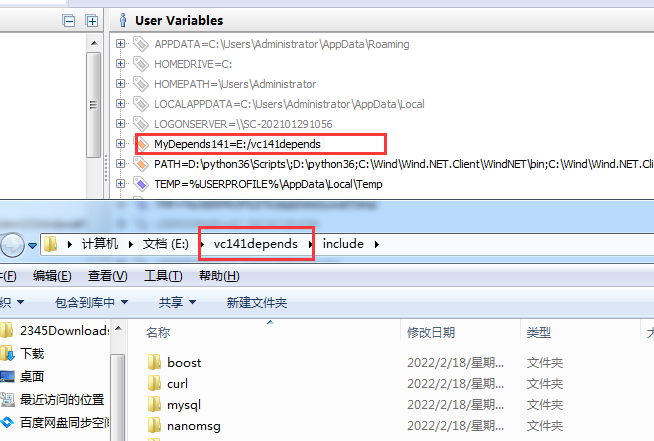
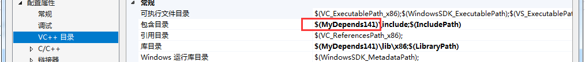

# win7系统编译

source: `{{ page.path }}`

测试系统：win7

## 资源准备

1. 源码的下载
http://github.com/wondertrader/wondertrader
2. 相关依赖库及环境变量设置工具等文件的下载:
https://pan.baidu.com/s/1Bdxh_PgjqHMzuGjl9ernhg 提取码:d6bh
下载后主要使用到的文件有三个：
vs2017_Community.exe（提供2017在线安装,提供的boost库的lib是141的，所以尽量使用vs2017）
vc141deps_win.7z（提供boost，spdlog，rapidjson等依库）
RapidEEx64.7z  （用于环境变量设置）

## 配置步骤
1. 安装vs2017(vs2017_Community.exe) ,因为2019编译时候可能出现boost的141库报错，不建议用2019.
2. 获取boost，spdlog等库文件，解压vc141deps_win.7z文件到E盘文件夹中vc141depends（如下图所示，也可放在其他盘）
3. 配置环境变量：解压RapidEEx64.7z文件，用管理员权限打开rapidee.exe，新建用户变量MyDepends141其值为 E:/vc141depends

4. 重启电脑,vs2017打开WonderTrader.sln，即可进行整个项目的编译。
5. 如以上步骤仍不成功,可进群610730738咨询.

## 问题：

1. TestUnits无法编译，找不到gtest.h?
- 该项目是测试用，使用到googletest，目前缺少相关文件，可忽略该项目,也自己配置googletest.

2. 为何配置值为MyDepends141的环境变量？
- 因为每个项目中的VC++目录的包含目录里定义了该路径，所以配置才可生效。
