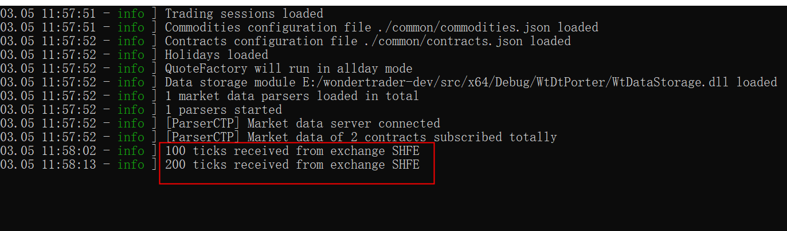
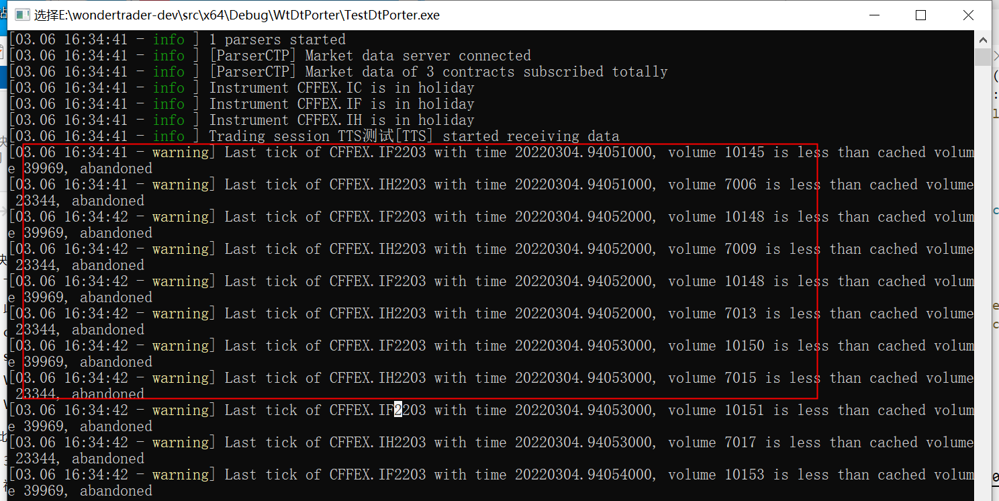

# UDP数据转发

source: `{{ page.path }}`

执行 `TestDtPorter` 下的 main.cpp

## 准备工作

### 1. 7*24小时环境

具体参考文章"对接openctp"

这一步非必要, 因为本人经常做测试, 又不喜欢用simnow, 同时要确保随时能获取数据做测试, 所以才使用了openctp. 

### 2. 配置文件

- dtcfg.yaml
- logcfgdt.yaml
- statemonitor.yaml
- mdparsers.yaml
- common配置目录
  - sessions.json"
  - commodities.json"
  - contracts.json"
  - holidays.json"
- parsers文件目录
  - ParserCTP.dll
  - thostmduserapi_se.dll

dtcfg.yaml 样式

```yaml
basefiles:
    utf-8: true     # 配置文件是否使用utf-8编码
    commodity: ./common/commodities.json
    contract: ./common/contracts.json
    holiday: ./common/holidays.json
    session: ./common/sessions.json
broadcaster:
    active: true
    bport: 3997         # UDP转发端口
    broadcast:
    -   host: 255.255.255.255
        port: 9001
        type: 2
    multicast_:
    -   host: 224.169.169.169
        port: 9002
        sendport: 8997
        type: 0
    -   host: 224.169.169.169
        port: 9003
        sendport: 8998
        type: 1
    -   host: 224.169.169.169
        port: 9004
        sendport: 8999
        type: 2
allday: true        # 是否启动7*24环境
parsers: mdparsers.yaml
statemonitor: statemonitor.yaml
writer:
    async: true
    groupsize: 100          # 每次接收多少条数据
    path: ./FUT_Data        # 数据保存文件夹
    savelog: true
```

mdparsers.yaml

```yaml
parsers:
-   active: true
    broker: ""
    id: tts24
    module: ParserCTP
    front: tcp://122.51.136.165:20004
    ctpmodule: tts_thostmduserapi_se
    pass: ******
    user: ******
    code: SHFE.au2206,SHFE.au2208 # 只接收指定合约数据
    # filter: SHFE,CZCE   # 只接收指定交易所数据
```

statemonitor.yaml 样式

```yaml
FD0900:
    closetime: 1515
    inittime: 850
    name: 期白0900
    proctime: 1600
FD0915:
    closetime: 1530
    inittime: 900
    name: 期白0915
    proctime: 1600
```

## 配置详解

### dtcfg.yaml

1. utf-8: true, 文件默认基本是gbk编码, 如果文件打开乱码或自己想改改, 就用utf-8编码
2. bport: 3997, 这个端口很重要, 因为行情接收和转发端口要保持一致(保持默认即可)
3. allday: true, 这个对测试很重要, 因为如果设置这个, wt默认会使用状态机检查当前的时间, 自动屏蔽非交易时间段, 比如,周末, 节假日等等. 因此使用7*24小时环境, 记得打开.

### mdparsers.yaml

1. broker: "", 可以为空字符串, 但是一定要写, (因为本人常犯此错, 所以记录下)
2. code: SHFE.au2206, 指定接收的合约(注意写法)
3. filter: SHFE, 指定接收的交易所(注意写法)

### statemonitor.yaml

如果使用7*24小时环境, 忽略即可, 如果使用一般环境, 用群里提供的配置文件即可

## 代码注释

`main.cpp` 主要通过 `WtDtPorter.cpp` 调用了 `WtDtRunner.cpp` 中的 `WtDtRunner::initialize` 和 `WtDtRunner::start` 方法.
代码其实很简单, 所以只注释下

### WtDtRunner::initialize

```cpp
void WtDtRunner::initialize(const char* cfgFile, const char* logCfg, const char* modDir /* = "" */)
{
	// 1. 初始化日志文件
	WTSLogger::init(logCfg);
	// 2. 设置工作目录 "Debug/WtDtPorter/"
	WtHelper::set_module_dir(modDir);

	// 3. 加载配置文件
	WTSVariant* config = WTSCfgLoader::load_from_file(cfgFile, true);
	if(config == NULL)
	{
		WTSLogger::error_f("Loading config file {} failed", cfgFile);
		return;
	}

	// 4. 加载基础环境配置文件
	WTSVariant* cfgBF = config->get("basefiles");
	// ...(省略代码)

	// 5. 初始化UDP广播组件
	_udp_caster.init(config->get("broadcaster"), &_bd_mgr, &_data_mgr);

	//By Wesley @ 2021.12.27
	//全天候模式，不需要再使用状态机
	bool bAlldayMode = config->getBoolean("allday");
	if (!bAlldayMode)
	{
		// 6. 初始化状态机
		_state_mon.initialize(config->getCString("statemonitor"), &_bd_mgr, &_data_mgr);
	}
	else
	{
		WTSLogger::info("QuoteFactory will run in allday mode");
	}
	// 7. 初始化数据落地组件
	initDataMgr(config->get("writer"), bAlldayMode);
	// 8. 初始化行情接口
	if (config->has("parsers"))
		initParsers(config->getCString("parsers"));
	else
		WTSLogger::log_raw(LL_WARN, "No parsers config, skipped loading parsers");

	config->release();
}
```

### WtDtRunner::start

```cpp
void WtDtRunner::start(bool bAsync /* = false */, bool bAlldayMode /* = false */)
{
	// 1. 启动行情接口
	_parsers.run();

    if(!bAsync)
    {
		_async_io.post([this]() {
			std::this_thread::sleep_for(std::chrono::milliseconds(5));
			// 2. 启动状态机
			_state_mon.run();
		});

        boost::asio::io_service::work work(_async_io);
        _async_io.run();
    }
	else
	{
		std::this_thread::sleep_for(std::chrono::milliseconds(5));
		_state_mon.run();
	}
}
```

## 成功验证



若出现如下 warning, 将原本保存的数据文件夹删掉即可


