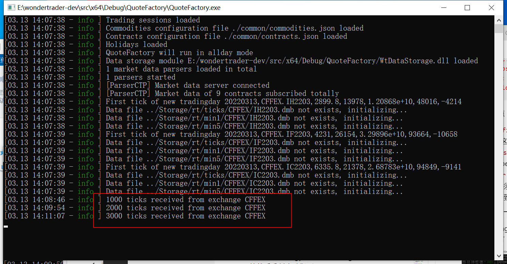
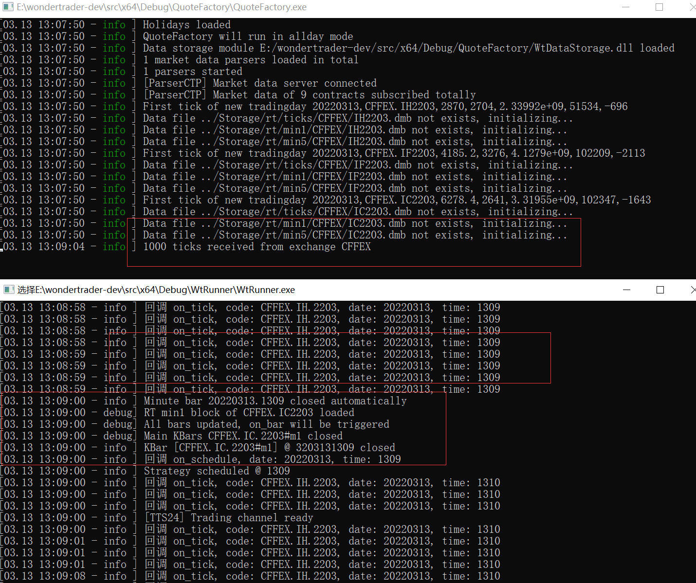

# CTA仿真进阶篇1: 环境部署

source: `{{ page.path }}`

相比HFT仿真, CTA的仿真更加复杂点, 因此我们之前先讲解了HFT仿真交易, 如果对此不熟悉的小伙伴建议看之前的文章. 只有熟悉了HFT仿真逻辑之后才能较容易理解CTA仿真逻辑.

本系列文章建立在你对WT项目已有一定了解的基础上. 我将会逐步探索CTA仿真交易的各个细节, 包括风控管理, 佣金配置, 执行器配置, 过滤器配置, 开平策略配置等. 因此对其他基础的配置包括文件加载等将会一笔带过.

## 启动数据落地程序

CTA仿真策略一般需要获取K线数据, 这就要求必须打开数据落地程序. (即接收交易所数据保存到本地, 并将数据广播到本地端口, 供其他程序使用)

其实有两个程序都可以实现这一功能, 一个是 `QuoteFactory`, 另一个是 `TestDtPorter`, 而 `TestDtPorter` 主要是方便上层调用的, 因此建议大家使用 `QuoteFactory` 打开数据落地程序.

### 文件配置

这里给出我使用的相关配置(7*24小时, openctp).

commodities.json

```json
{
    "CFFEX": {
        "IC": {
            "covermode": 0,
            "pricemode": 0,
            "category": 1,
            "precision": 1,
            "pricetick": 0.2,
            "volscale": 200,
            "name": "中证֤",
            "exchg": "CFFEX",
            "session": "TTS24",
            "holiday": "CHINA"
        },
        "IF": {
            "covermode": 0,
            "pricemode": 0,
            "category": 1,
            "precision": 1,
            "pricetick": 0.2,
            "volscale": 300,
            "name": "沪深",
            "exchg": "CFFEX",
            "session": "TTS24",
            "holiday": "CHINA"
        },
        "IH": {
            "covermode": 0,
            "pricemode": 0,
            "category": 1,
            "precision": 1,
            "pricetick": 0.2,
            "volscale": 300,
            "name": "上证",
            "exchg": "CFFEX",
            "session": "TTS24",
            "holiday": "CHINA"
        }
    }
}
```

contracts.json

```json
{
    "CFFEX": {
        "IC2203": {
            "name": "中证2203",
            "code": "IC2203",
            "exchg": "CFFEX",
            "product": "IC",
            "maxlimitqty": 20,
            "maxmarketqty": 10
        },
        "IC2206": {
            "name": "中证֤2206",
            "code": "IC2206",
            "exchg": "CFFEX",
            "product": "IC",
            "maxlimitqty": 20,
            "maxmarketqty": 10
        },
        "IC2209": {
            "name": "中证֤2209",
            "code": "IC2209",
            "exchg": "CFFEX",
            "product": "IC",
            "maxlimitqty": 20,
            "maxmarketqty": 10
        },
        "IF2203": {
            "name": "沪深2203",
            "code": "IF2203",
            "exchg": "CFFEX",
            "product": "IF",
            "maxlimitqty": 20,
            "maxmarketqty": 10
        },
        "IF2206": {
            "name": "沪深2206",
            "code": "IF2206",
            "exchg": "CFFEX",
            "product": "IF",
            "maxlimitqty": 20,
            "maxmarketqty": 10
        },
        "IF2209": {
            "name": "沪深2209",
            "code": "IF2209",
            "exchg": "CFFEX",
            "product": "IF",
            "maxlimitqty": 20,
            "maxmarketqty": 10
        },
        "IH2203": {
            "name": "上证֤2203",
            "code": "IH2203",
            "exchg": "CFFEX",
            "product": "IH",
            "maxlimitqty": 20,
            "maxmarketqty": 10
        },
        "IH2206": {
            "name": "上证֤2206",
            "code": "IH2206",
            "exchg": "CFFEX",
            "product": "IH",
            "maxlimitqty": 20,
            "maxmarketqty": 10
        },
        "IH2209": {
            "name": "上证֤֤2209",
            "code": "IH2209",
            "exchg": "CFFEX",
            "product": "IH",
            "maxlimitqty": 20,
            "maxmarketqty": 10
        }
    }
}
```

sessions.json

```json
{
    "TTS24":{
        "name":"TTS24测试",
        "offset": -480,
        "auction":{
            "from": 802,
            "to": 803
        },
        "sections":[
            {
                "from": 803,
                "to": 758
            }
        ]
    },
    "ALLDAY":{
        "name":"全天候盘",
        "offset": -480,
        "sections":[
            {
                "from": 800,
                "to": 800
            }
        ]
    }
}
```

QFConfig.yaml

```yaml
basefiles:
    commodity: ./common/commodities.json
    contract: ./common/contracts.json
    holiday: ./common/holidays.json
    session: ./common/sessions.json
broadcaster:
    active: true
    bport: 3997
    broadcast:
    -   host: 255.255.255.255
        port: 9001
        type: 2
    multicast_:
    -   host: 224.169.169.169
        port: 9002
        sendport: 8997
        type: 0
    -   host: 224.169.169.169
        port: 9003
        sendport: 8998
        type: 1
    -   host: 224.169.169.169
        port: 9004
        sendport: 8999
        type: 2
allday: true    # 使用全天候环境
parsers:
-   active: true
    broker: 
    id: tts24
    module: ParserCTP
    front: tcp://122.51.136.165:20004
    localtime: true     # 使用本地时间戳
    ctpmodule: tts_thostmduserapi_se
    pass: ******
    user: ******
    # code: SHFE.au2206,SHFE.au2208
    filter: CFFEX
statemonitor: statemonitor.yaml
writer:
    module: WtDataStorage
    async: true
    groupsize: 1000
    path: ../Storage
    savelog: false
```

这里提醒两点

1. `QFConfig.yaml` 文件一个是启用了 `allday` 字段, 这样就可以避免状态机干扰测试环境
2. 在 `parsers` 中启用了 `localtime` 字段, 这在使用openctp时是必须做的.
3. `writer` 中设置数据保存目录是 `../Storage`, 这个必须和接下来的CTP仿真时数据读取目录保持一致

### 成功截图如下

若出现warning, 则将 "Storage" 文件目录删掉然后重新启动即可



## 重写CTA策略

为了方便调试, 我对 "WtStraDualThrust" 做了细微改动, 主要是打印回调记录, 源码如下

**WtStraDualThrust.h**

```cpp
#pragma once
#include "../Includes/CtaStrategyDefs.h"

class WtStraDualThrust : public CtaStrategy
{
public:
	WtStraDualThrust(const char* id);
	virtual ~WtStraDualThrust();

public:
	virtual const char* getFactName() override;

	virtual const char* getName() override;

	virtual bool init(WTSVariant* cfg) override;

	virtual void on_schedule(ICtaStraCtx* ctx, uint32_t curDate, uint32_t curTime) override;

	virtual void on_init(ICtaStraCtx* ctx) override;

	virtual void on_tick(ICtaStraCtx* ctx, const char* stdCode, WTSTickData* newTick) override;

	virtual void on_bar(ICtaStraCtx* ctx, const char* stdCode, const char* period, WTSBarStruct* newBar) override;


private:
	//指标参数
	double		_k1;
	double		_k2;
	uint32_t	_days;

	//数据周期
	std::string _period;
	//K线条数
	uint32_t	_count;

	//合约代码
	std::string _code;

	bool		_isstk;
};
```

**WtStraDualThrust.h**

```cpp
#include "WtStraDualThrust.h"

#include "../Includes/ICtaStraCtx.h"

#include "../Includes/WTSContractInfo.hpp"
#include "../Includes/WTSVariant.hpp"
#include "../Includes/WTSDataDef.hpp"
#include "../Share/decimal.h"

extern const char* FACT_NAME;

//By Wesley @ 2022.01.05
#include "../Share/fmtlib.h"

WtStraDualThrust::WtStraDualThrust(const char* id)
	: CtaStrategy(id)
{
}


WtStraDualThrust::~WtStraDualThrust()
{
}

const char* WtStraDualThrust::getFactName()
{
	return FACT_NAME;
}

const char* WtStraDualThrust::getName()
{
	return "DualThrust";
}

bool WtStraDualThrust::init(WTSVariant* cfg)
{

	if (cfg == NULL)
		return false;

	_days = cfg->getUInt32("days");
	_k1 = cfg->getDouble("k1");
	_k2 = cfg->getDouble("k2");

	_period = cfg->getCString("period");
	_count = cfg->getUInt32("count");
	_code = cfg->getCString("code");

	_isstk = cfg->getBoolean("stock");

	return true;
}

void WtStraDualThrust::on_schedule(ICtaStraCtx* ctx, uint32_t curDate, uint32_t curTime)
{
	ctx->stra_log_info(fmt::format("回调 on_schedule, date: {}, time: {}", ctx->stra_get_date(), ctx->stra_get_time()).c_str());
	// 如果本地无数据, 继续向下执行就会报错
	return;

	std::string code = _code;
	if (_isstk)
		code += "-";
	WTSKlineSlice *kline = ctx->stra_get_bars(code.c_str(), _period.c_str(), _count, true);
	if(kline == NULL)
	{
		//这里可以输出一些日志
		return;
	}

	if (kline->size() == 0)
	{
		kline->release();
		return;
	}

	uint32_t trdUnit = 1;
	if (_isstk)
		trdUnit = 100;


	int32_t days = (int32_t)_days;

	double hh = kline->maxprice(-days, -2);
	double ll = kline->minprice(-days, -2);

	WTSValueArray* closes = kline->extractData(KFT_CLOSE);
	double hc = closes->maxvalue(-days, -2);
	double lc = closes->minvalue(-days, -2);
	double curPx = closes->at(-1);
	closes->release();///!!!这个释放一定要做

	double openPx = kline->at(-1)->open;
	double highPx = kline->at(-1)->high;
	double lowPx = kline->at(-1)->low;

	double upper_bound = openPx + _k1 * (std::max(hh - lc, hc - ll));
	double lower_bound = openPx - _k2 * std::max(hh - lc, hc - ll);

	WTSCommodityInfo* commInfo = ctx->stra_get_comminfo(_code.c_str());

	double curPos = ctx->stra_get_position(_code.c_str()) / trdUnit;
	if(decimal::eq(curPos,0))
	{
		if(highPx >= upper_bound)
		{
			ctx->stra_enter_long(_code.c_str(), 2 * trdUnit, "DT_EnterLong");
			//向上突破
			ctx->stra_log_info(fmt::format("向上突破{}>={},多仓进场", highPx, upper_bound).c_str());
		}
		else if (lowPx <= lower_bound && !_isstk)
		{
			ctx->stra_enter_short(_code.c_str(), 2 * trdUnit, "DT_EnterShort");
			//向下突破
			ctx->stra_log_info(fmt::format("向下突破{}<={},空仓进场", lowPx, lower_bound).c_str());
		}
	}
	//else if(curPos > 0)
	else if (decimal::gt(curPos, 0))
	{
		if(lowPx <= lower_bound)
		{
			//多仓出场
			ctx->stra_exit_long(_code.c_str(), 2 * trdUnit, "DT_ExitLong");
			ctx->stra_log_info(fmt::format("向下突破{}<={},多仓出场", lowPx, lower_bound).c_str());
		}
	}
	//else if(curPos < 0)
	else if (decimal::lt(curPos, 0))
	{
		if (highPx >= upper_bound && !_isstk)
		{
			//空仓出场
			ctx->stra_exit_short(_code.c_str(), 2 * trdUnit, "DT_ExitShort");
			ctx->stra_log_info(fmt::format("向上突破{}>={},空仓出场", highPx, upper_bound).c_str());
		}
	}

	ctx->stra_save_user_data("test", "waht");

	//这个释放一定要做
	kline->release();
}

void WtStraDualThrust::on_init(ICtaStraCtx* ctx)
{
	ctx->stra_log_info(fmt::format("回调 on_init, date: {}, time: {}", ctx->stra_get_date(), ctx->stra_get_time()).c_str());

	std::string code = _code;
	if (_isstk)
		code += "-";

	// 获取 CFFEX.IC.2203 的tick数据
	WTSTickSlice* ticks = ctx->stra_get_ticks(_code.c_str(), 30);
	if (ticks)
		ticks->release();

	// 获取 CFFEX.IC.2203 的bar数据
	WTSKlineSlice *kline1 = ctx->stra_get_bars(code.c_str(), _period.c_str(), _count, true);
	if (kline1 == NULL)
	{
		//这里可以输出一些日志
		return;
	}
	kline1->release();

	// 主动订阅 CFFEX.IH.2203 tick数据
	ctx->stra_sub_ticks("CFFEX.IH.2203");
}

void WtStraDualThrust::on_tick(ICtaStraCtx* ctx, const char* stdCode, WTSTickData* newTick)
{
	//没有什么要处理
	ctx->stra_log_info(fmt::format("回调 on_tick, code: {}, date: {}, time: {}", newTick->code(), ctx->stra_get_date(), ctx->stra_get_time()).c_str());
}

void WtStraDualThrust::on_bar(ICtaStraCtx* ctx, const char* stdCode, const char* period, WTSBarStruct* newBar)
{
	//没有什么要处理
	ctx->stra_log_info(fmt::format("回调 on_bar, code: {}, date: {}, time: {}", stdCode, ctx->stra_get_date(), ctx->stra_get_time()).c_str());
}
```

1. 修改完之后记得重新生成 dll文件并放到 "WtRunner/cta" 目录下
2. 确保 "WtRunner/executer" 下有CTA执行器dll文件 "WtExeFact.dll"

## CTA策略配置

1."common" 文件夹内容和 "QuoteFactory/common" 保持一致即可

2.actpolicy.yaml

```yaml
default:
    order:
    -   action: close
        limit: 0
    -   action: open
        limit: 0
stockindex:
    filters:
    - CFFEX.IF
    - CFFEX.IC
    - CFFEX.IH
    order:
    -   action: closeyestoday
        limit: 0
    -   action: open
        limit: 500
    -   action: closetoday
        limit: 0
```

3.filters.yaml

```yaml
code_filters:
    CFFEX.IF0:
        action: ignore
        target: 0
strategy_filters:
    Q3LS00_if0:
        action: ignore
        target: 0
```

4.executers.yaml

```yaml
# 一个组合可以配置多个执行器，所以executers是一个list
executers:
-   active: true    	#是否启用
    id: exec        	#执行器id，不可重复
    trader: tts24  	    #执行器绑定的交易通道id，如果不存在，无法执行
    scale: 1        	#数量放大倍数，即该执行器的目标仓位，是组合理论目标仓位的多少倍，可以为小数 

    policy:         #执行单元分配策略，系统根据该策略创建对一个的执行单元
        default:    #默认策略，根据品种ID设置，如SHFE.rb，如果没有针对品种设置，则使用默认策略
            name: WtExeFact.WtMinImpactExeUnit, #执行单元名称
            offset: 0,      #委托价偏移跳数
            expire: 5,      #订单超时没秒数
            pricemode: 1,   #基础价格模式，-1-己方最优，0-最新价，1-对手价
            span: 500,      #下单时间间隔（tick驱动的）
            byrate: false,  #是否按对手盘挂单量的比例挂单，配合rate使用
            lots: 1,        #固定数量
            rate: 0         #挂单比例，配合byrate使用

    clear:                  #过期主力自动清理配置
        active: false       #是否启用
        excludes:           #排除列表
        # - CFFEX.IF
        - CFFEX.IC
        includes:           #包含列表
        # - SHFE.au
```

5.tdparsers.yaml

```yaml
parsers:
-   active: true
    bport: 9001
    host: 127.0.0.1
    id: TTS24
    module: ParserUDP
    sport: 3997
```

6.tdtraders.yaml

```yaml
traders:
-   active: true
    id: TTS24
    module: TraderCTP
    ctpmodule: tts_thosttraderapi_se
    front: tcp://122.51.136.165:20002
    broker: ""
    user: ******
    pass: ******
    appid:
    authcode:
    quick: true
    riskmon:
        active: false
        policy:
            default:
                order_times_boundary: 20
                order_stat_timespan: 10
                cancel_times_boundary: 20
                cancel_stat_timespan: 10
                cancel_total_limits: 470
```

7.config.yaml

```yaml
#基础配置文件
basefiles:
    utf-8: true
    commodity: ./common/commodities.json   #品种列表
    contract: ./common/contracts.json      #合约列表
    holiday: ./common/holidays.json        #节假日列表
    hot: ./common/hots.json                #主力合约映射表
    session: ./common/sessions.json        #交易时间模板
#数据存储
data:
    store:
        module: WtDataStorage   #模块名
        path: ../Storage/      #数据存储根目录
#环境配置
env:
    name: cta               #引擎名称：cta/hft/sel
    product:
        session: TTS24    #驱动交易时间模板，TRADING是一个覆盖国内全部交易品种的最大的交易时间模板，从夜盘21点到凌晨1点，再到第二天15:15，详见sessions.json
    riskmon:                #组合风控设置
        active: false            #是否开启
        module: WtRiskMonFact   #风控模块名，会根据平台自动补齐模块前缀和后缀
        name: SimpleRiskMon     #风控策略名，会自动创建对应的风控策略
        #以下为风控指标参数，该风控策略的主要逻辑就是日内和多日的跟踪止损风控，如果回撤超过阈值，则降低仓位
        base_amount: 5000000    #组合基础资金，WonderTrader只记录资金的增量，基础资金是用来模拟组合的基本资金用的，和增量相加得到动态权益
        basic_ratio: 101        #日内高点百分比，即当日最高动态权益是上一次的101%才会触发跟踪侄止损
        calc_span: 5            #计算时间间隔，单位s
        inner_day_active: true  #日内跟踪止损是否启用
        inner_day_fd: 20.0      #日内跟踪止损阈值，即如果收益率从高点回撤20%，则触发风控
        multi_day_active: false #多日跟踪止损是否启用
        multi_day_fd: 60.0      #多日跟踪止损阈值
        risk_scale: 0.3         #风控系数，即组合给执行器的目标仓位，是组合理论仓位的0.3倍，即真实仓位是三成仓
        risk_span: 30           #风控触发时间间隔，单位s。因为风控计算很频繁，如果已经触发风控，不需要每次重算都输出风控日志，加一个时间间隔，友好一些
strategies:
    cta:    # 策略工厂配置
    -   active: true
        id: cta_demo    # 策略id
        name: WtCtaStraFact.DualThrust    # 策略名
        params:     # 策略参数
            code: CFFEX.IC.2203
            count: 30
            period: m1
            days: 30
            k1: 0.6
            k2: 0.6
            stock: false

fees: ./common/fees.json   #佣金配置文件
executers: executers.yaml   #执行器配置文件
filters: filters.yaml      	#过滤器配置文件，这个主要是用于盘中不停机干预的
parsers: tdparsers.yaml     #行情通达配置文件
traders: tdtraders.yaml     #交易通道配置文件
bspolicy: actpolicy.yaml    #开平策略配置文件
```

### 配置概述

1. "tdparsers.yaml", 不在直接从仿真服务器获取数据, 而是本地端口获取数据, 这就是行情落地程序必须打开的直接原因.
2. "tdparsers.yaml", 这里不再需要设置 `localtime` 字段.
3. "config.yaml", 也不在需要 `allday` 字段.
4. "config.yaml", 中的 `strategies/name` 字段策略名称必须和 `WtCtaStraFact.cpp` 中的名称保持一致.

## 全部配置成功示例如下

不仅要保证 `on_tick` 回调成功, 更要保证分钟闭合后 `on_schedule` 和 `on_bar` 回调成功

