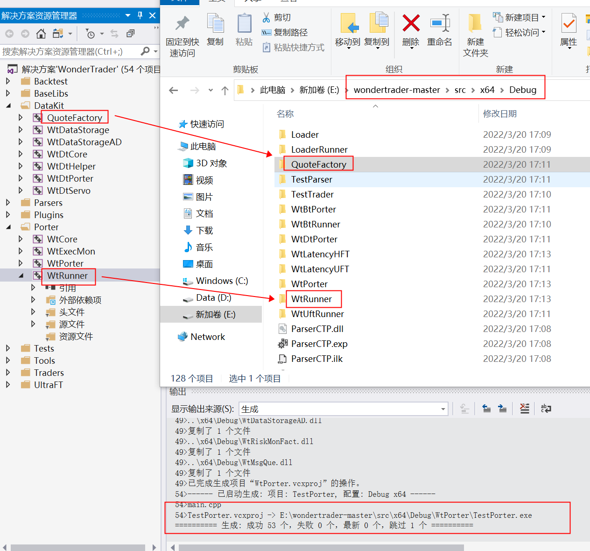
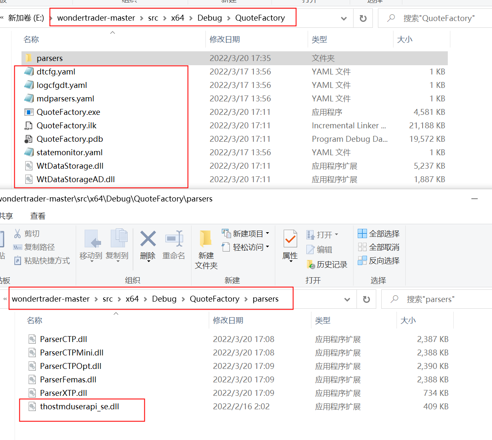
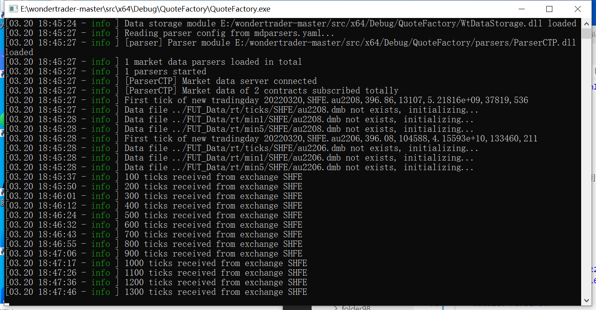
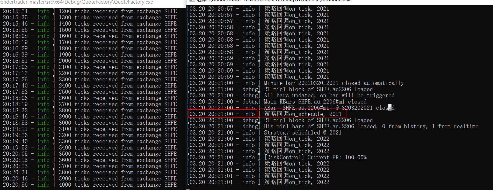

# CTA仿真完整篇1: 环境准备

source: `{{ page.path }}`

之前的文章都是基于0.9dev版本的, 最近WT0.9稳定版更新了, 趁着这个机会, 我下载了WT0.9master版本, 并开始重新梳理WT项目逻辑.

## 生成解决方案

1. 从github下载"wondertrader-master"(最新0.9版本), 解压, 进入"src/"目录, 用VS2017打开 "WonderTrader.sln"
2. 工具栏选择 "Debug" , "x64", 然后菜单栏选择"生成", "生成解决方案".(需要几分钟)
3. 此时"src/"目录最下边会出现一个"x64/"目录, 进入"x64/Debug", 之前生成的文件都在这里.
4. "Debug/"目录下"QuoteFactory/"文件夹对应项目中"DataKit/QuoteFactory", 主要负责接收市场行情, 然后: 1. 保存数据到本地(盘中临时数据是 dmb, 收盘之后会压缩成 dsb), 2. 向本地端口推送行情, 这个在配置中.
5. "Debug/"目录下"WtRunner/"文件夹对应项目中"Porter/WtRunner"
6. 右击"QuoteFactory"项目属性, 选择"调试"->"工作目录", 修改为"OutDir"; 右击"WtRunner"项目属性, 选择"调试"->"工作目录", 修改为"OutDir". 这一步修改是为了以后调试方便, 修改成"OutDir"后, 若是对文件做了改动, 以后项目输出文件都会输出到对应名称目录下.

现在你的项目和文件目录应该大致如下



## QuoteFactory

首先需要先配置好"QuoteFactory"

### 添加文件

1.获取配置文件

进入"wondertrader-master/dist/QuoteFactory"目录下, 将所有yaml文件复制粘贴到"wondertrader-master/src/x64/Debug/QuoteFactory"目录下.

进入"wondertrader-master/dist/"目录下, 将"common"整个文件夹复制粘贴到"wondertrader-master/src/x64/Debug/"目录下.

2.获取openctp行情dll文件

进入openctp官网下载对应版本(6.3.15)的"thostmduserapi_se.dll"放到"QuoteFactory/parser"目录下

现在你的项目和文件目录应该大致如下



### 修改配置

dtcfg.yaml 这个是该程序主要配置项, 添加一个字段 `allday: true` 即可

```yaml
basefiles:
    commodity: ../common/commodities.json
    contract: ../common/contracts.json
    holiday: ../common/holidays.json
    session: ../common/sessions.json
broadcaster:
    active: true
    bport: 3997
    broadcast:
    -   host: 255.255.255.255
        port: 9001
        type: 2
    multicast_:
    -   host: 224.169.169.169
        port: 9002
        sendport: 8997
        type: 0
    -   host: 224.169.169.169
        port: 9003
        sendport: 8998
        type: 1
    -   host: 224.169.169.169
        port: 9004
        sendport: 8999
        type: 2
allday: true
parsers: mdparsers.yaml
statemonitor: statemonitor.yaml
writer:
    async: true
    groupsize: 100
    path: ../FUT_Data
    savelog: true
```

mdparsers.yaml 本地行情端口(`localtime: true`)

```yaml
parsers:
-   active: true
    broker: ''
    code: SHFE.au2206,SHFE.au2208  # 品种过滤
    front: ttcp://122.51.136.165:20004
    id: parser
    localtime: true
    module: ParserCTP
    pass: ******        # openctp 账户密码
    user: ******
```

```tip
为方便随时测试, 我们需要添加一个全天候盘的交易时段
```

../common/session.json

```json
"ALLDAY":{
    "name":"全天候盘",
    "offset": -480,
    "sections":[
        {
            "from": 800,
            "to": 800
        }
    ]
},
```

然后将对应的品种也修改为该交易时段 `"session": "ALLDAY"`

../common/commodities.json

```json
"au": {
    "covermode": 1,
    "pricemode": 1,
    "category": 1,
    "precision": 2,
    "pricetick": 0.02,
    "volscale": 1000,
    "name": "沪金",
    "exchg": "SHFE",
    "session": "ALLDAY",
    "holiday": "CHINA"
},
```

其他配置文件, 不用管

运行程序即可, 运行结果应该大致如下(如出现警告, 删除"FUT_Data"文件夹即可)



## WtRunner

### 添加文件

1.获取配置文件

wtRunner配置文件参考 "wondertrader-master/dist/WtRunnerCta", 依旧是全部复制

2.获取openctp行情dll文件

进入openctp官网下载对应版本(6.3.15)的"thostmduserapi_se.dll"放到"WtRunner/parser"目录下, "thosttraderapi_se.dll"放到"WtRunner/traders"目录下

## 修改文件

config.yaml 是该程序主要配置文件, 修改品种为 "SHFE.au.2206"(建议复制粘贴)

```yaml
#基础配置文件
basefiles:
    commodity: ../common/commodities.json   #品种列表
    contract: ../common/contracts.json      #合约列表
    holiday: ../common/holidays.json        #节假日列表
    hot: ../common/hots.json                #主力合约映射表
    session: ../common/sessions.json        #交易时间模板
#数据存储
data:
    store:
        path: ../FUT_Data/      #数据存储根目录

#环境配置
env:
    name: cta               #引擎名称：cta/hft/sel
    product:
        session: ALLDAY    #驱动交易时间模板，TRADING是一个覆盖国内全部交易品种的最大的交易时间模板，从夜盘21点到凌晨1点，再到第二天15:15，详见sessions.json
    riskmon:                #组合风控设置
        active: false            #是否开启
        module: WtRiskMonFact   #风控模块名，会根据平台自动补齐模块前缀和后缀
        name: SimpleRiskMon     #风控策略名，会自动创建对应的风控策略
        #以下为风控指标参数，该风控策略的主要逻辑就是日内和多日的跟踪止损风控，如果回撤超过阈值，则降低仓位
        base_amount: 5000000    #组合基础资金，WonderTrader只记录资金的增量，基础资金是用来模拟组合的基本资金用的，和增量相加得到动态权益
        basic_ratio: 101        #日内高点百分比，即当日最高动态权益是上一次的101%才会触发跟踪侄止损
        calc_span: 5            #计算时间间隔，单位s
        inner_day_active: true  #日内跟踪止损是否启用
        inner_day_fd: 20.0      #日内跟踪止损阈值，即如果收益率从高点回撤20%，则触发风控
        multi_day_active: false #多日跟踪止损是否启用
        multi_day_fd: 60.0      #多日跟踪止损阈值
        risk_scale: 0.3         #风控系数，即组合给执行器的目标仓位，是组合理论仓位的0.3倍，即真实仓位是三成仓
        risk_span: 30           #风控触发时间间隔，单位s。因为风控计算很频繁，如果已经触发风控，不需要每次重算都输出风控日志，加一个时间间隔，友好一些

strategies:
    # CTA策略配置，当mocker为cta时会读取该配置项
    cta:
    -   active: true       # 模块名，linux下为xxxx.so
        id: dt_if          # 策略ID，自定义的
        name: WtCtaStraFact.DualThrust   # 策略名，要和factory中的匹配
        params:                         # 策略初始化参数，这个根据策略的需要提供
            code: SHFE.au.2206
            count: 1
            days: 30
            k1: 0.6
            k2: 0.6
            period: m1
            stock: false
            
fees: ../common/fees.json   #佣金配置文件
executers: executers.yaml   #执行器配置文件
filters: filters.yaml       #过滤器配置文件，这个主要是用于盘中不停机干预的
parsers: tdparsers.yaml     #行情通达配置文件
traders: tdtraders.yaml     #交易通道配置文件
bspolicy: actpolicy.yaml    #开平策略配置文件
```

tdparsers.yaml 配置文件如下

```yaml
parsers:
-   active: true
    bport: 9001
    filter: ''
    host: 127.0.0.1
    id: parser1
    module: ParserUDP
    sport: 3997
```

tdtraders.yaml 配置文件如下

```yaml
traders:
-   active: true
    appid: ''
    authcode: ''
    broker: ''
    front: tcp://122.51.136.165:20002
    id: tts
    module: TraderCTP
    user: ******
    pass: ******
    quick: true
    riskmon:
        active: true
        policy:
            default:
                cancel_stat_timespan: 10
                cancel_times_boundary: 20
                cancel_total_limits: 470
                order_stat_timespan: 10
                order_times_boundary: 20
```

executers.yaml(建议复制粘贴)

```yaml
#一个组合可以配置多个执行器，所以executers是一个list
executers:
-   active: true    #是否启用
    id: exec         #执行器id，不可重复
    trader: tts     #执行器绑定的交易通道id，如果不存在，无法执行
    scale: 1         #数量放大倍数，即该执行器的目标仓位，是组合理论目标仓位的多少倍，可以为小数 
    local: true     # 启用本地执行器

    policy:         #执行单元分配策略，系统根据该策略创建对一个的执行单元
        default:        #默认策略，根据品种ID设置，如SHFE.rb，如果没有针对品种设置，则使用默认策略
            name: WtExeFact.WtMinImpactExeUnit      #执行单元名称
            offset: 0       #委托价偏移跳数
            expire: 5       #订单超时没秒数
            pricemode: 1    #基础价格模式，-1-己方最优，0-最新价，1-对手价
            span: 500       #下单时间间隔（tick驱动的）
            byrate: false   #是否按对手盘挂单量的比例挂单，配合rate使用
            lots: 1         #固定数量
            rate: 0         #挂单比例，配合byrate使用

    clear:                  #过期主力自动清理配置
        active: false       #是否启用
        excludes:           #排除列表
        - CFFEX.IF
        - CFFEX.IC
        includes:           #包含列表
        - SHFE.rb
```

其他配置文件可以不用管

### 修改策略

WT自带的CTA策略输出的信息太少, 我们需要略微修改下, 方便调试

打开 "Plugins/WtCtaStraFact/WtStraDualThrust.cpp"

1.`on_tick` 首行添加

```cpp
ctx->stra_log_info(fmt::format("策略回调on_tick, {}", ctx->stra_get_time()).c_str());
```

2.`on_init`首行添加

```cpp
ctx->stra_log_info(fmt::format("策略回调on_init, {}", ctx->stra_get_time()).c_str());
ctx->stra_sub_ticks(code.c_str());
```

3.`on_schedule`首行添加

```cpp
ctx->stra_log_info(fmt::format("策略回调on_schedule, {}", ctx->stra_get_time()).c_str());
```

4.右击项目"Plugins/WtCtaStraFact", 重新生成, 然后在"Debug/"目录下找到"WtCtaStraFact.dll", 放到"WtRunner/cta/"目录下(替换)

## 测试成功

1. 启动"QuoteFactory.exe"(建议每次启动前删除"FUT_Data"数据目录)
2. 启动"WtRunner.exe"
3. 一定要在分钟结束后看到"策略回调on_schedule"才算成功

