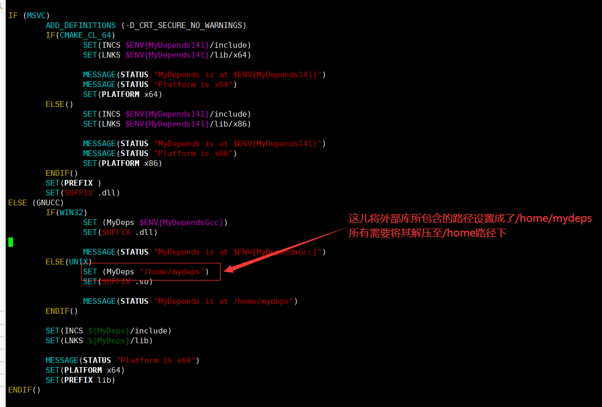
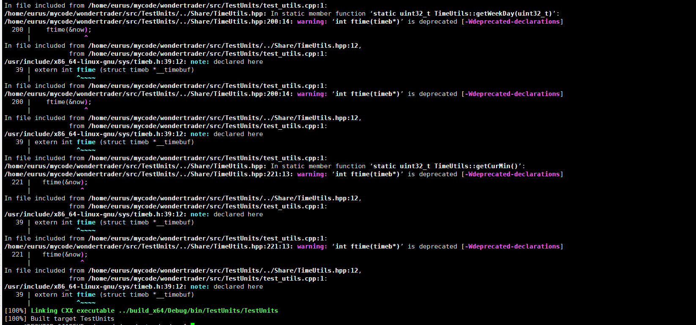

# WonderTrader-ubuntu安装

source: `{{ page.path }}`

1. 安装环境，执行以下命令。

   `sudo apt install build-essential -y`

   `sudo apt install cmake -y`

   `sudo apt-get install p7zip-full -y`

2. 从共享资源中将mydeps_ubt1804_1204.7z上传到虚拟机，解压，注意解压后的文件一定要放在`/home`目录下。因为编译的CMakeList里面将所用到的boost库文件目录写的是 `/home/mydeps`   。解压命令如下：`sudo 7z x mydeps_ubt1804_1204.7z`。结果如下: 

   

   

3. 拉取WonderTrader的源码:

   `sudo git clone https://github.com/wondertrader/wondertrader.git`

4. ​

   进入src目录，执行编译脚本。这儿第一次build_debug.sh没有权限，需要手动进行chmod 777 build_debug.sh。

   `sudo ./build_debug.sh`

   