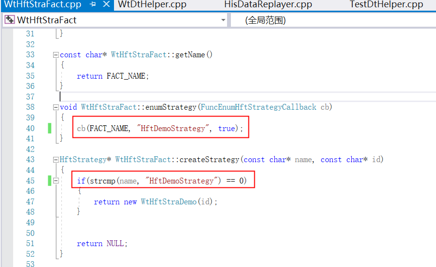
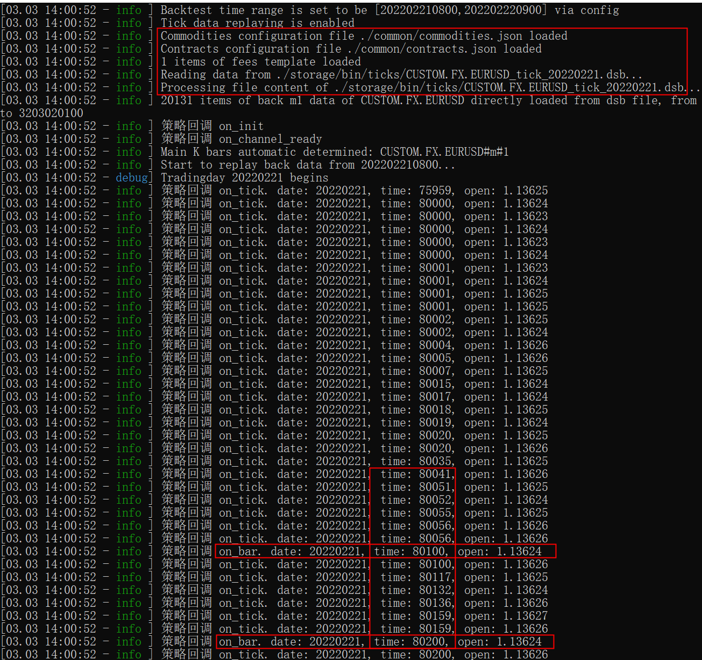

# HFT回测进阶1: 环境准备

source: `{{ page.path }}`

```tip
请使用最新版0.9dev源码(20220303)
```

## 准备数据

1. 参考文章"数据压缩/解压"准备自己的数据(包括bar级csv数据和tick级dsb数据)
2. 本文自己准备的数据(外汇数据, 假设交易所: CUSTOM, 品种: FX, 合约名称: EURUSD, 1分钟csv数据, tick级dsb数据)

## 准备配置文件

### 1. 配置文件

- logcfgbt.yaml 
- configbt.yaml
- storage(数据目录)
  - bin(压缩数据, tick回放使用)
    - ticks(tick数据每天一个文件,起名要按固定格式)
      - CUSTOM.FX.EURUSD_tick_20220221.dsb
      - CUSTOM.FX.EURUSD_tick_20220222.dsb
      - CUSTOM.FX.EURUSD_tick_20220223.dsb
  - csv(csv数据, bar回放使用, 文件名固定格式)
    - CUSTOM.FX.EURUSD_m1
- common(配置目录)
  - commodities.json"
  - contracts.json"
  - fees.json"
  - holidays.json"
  - sessions.json"

configbt.yaml 样式

```yaml
# 回测参数
replayer:
    basefiles:
        commodity: ./common/commodities.json
        contract: ./common/contracts.json
        holiday: ./common/holidays.json
        session: ./common/sessions.json
    mode: csv       # 回测模式, 可自动加载csv文件下的bar数据
    path: ./storage/
    fees: ./common/fees.json
    stime: 202202210800    # tick回测一天数据量足够测试了
    etime: 202202220900
    tick: true      # 使用tick数据, 如果为false, 会自动生成模拟tick数据
env:
    mocker: hft     # 模式
    slippage: 5     # 滑点
hft:
    error_rate: 30
    # 策略工厂dll文件名称
    module: WtHftStraFact
    # 策略配置
    strategy:
        id: hft_id
        # 策略名称(在策略工厂源码中有用)
        name: HftDemoStrategy
        # 策略参数
        params:
            code: CUSTOM.FX.EURUSD
            count: 6
            second: 5
            freq: 20
            offset: 0
            reserve: 0
            stock: false
    use_newpx: true
```

logcfgbt.yaml

```yaml
dyn_pattern:
    strategy:
        async: false
        level: debug
        sinks:
        -   filename: BtLogs/Strategy/%s.log
            pattern: '[%Y.%m.%d %H:%M:%S - %-5l] %v'
            truncate: true
            type: basic_file_sink
root:
    async: false
    level: debug
    sinks:
    -   filename: BtLogs/BtRunner.log
        pattern: '[%Y.%m.%d %H:%M:%S,%F - %-5l] %v'
        truncate: true
        type: basic_file_sink
    -   pattern: '[%m.%d %H:%M:%S - %^%-5l%$] %v'
        type: console_sink
```

```tip
以下配置都是根据个人情况自定义配置的
```

commodities.json

```json
{
    "CUSTOM": {
        "FX": {
            "covermode": 0,
            "pricemode": 0,
            "category": 1,
            "precision": 5,
            "pricetick": 0.00001,
            "volscale": 500,
            "name": "外汇",
            "exchg": "CUSTOM",
            "session": "ALLDAY",
            "holiday": "USD"
        }
    }
}
```

contracts.json

```json
{
    "CUSTOM": {
        "EURUSD": {
            "name": "欧元兑美元",
            "code": "EURUSD",
            "exchg": "CUSTOM",
            "product": "FX",
            "maxlimitqty": 20,
            "maxmarketqty": 10
        }
    }
}
```

fees.json

```json
{
    "CUSTOM.FX":
    {
        "open":0.00023,
        "close":0.00023,
        "closetoday":0.0,
        "byvolume":true
    }
}
```

holidays.json

```json
{
    "USD" : [20210212,20210215,20210216,20210217,20210405,20210503,20210504,20210505,20210614,20210920,20210921,20211001,20211004,20211005,20211006,20211007]
}
```

sessions.json

```json
{
    "ALLDAY":{
        "name":"全天候盘",
        "offset": -480,
        "sections":[
            {
                "from": 800,
                "to": 800
            }
        ]
    }
}
```

## 准备策略

1.为了方便回测, 建议修改策略文件 `WtHftStraDemo.cpp` , 主要是在策略中添加一些日志输出信息, 方便调试. 这里就直接给源码, 不再解释(主要添加了 `_ctx->stra_log_info...` )

```cpp
#include "WtHftStraDemo.h"
#include "../Includes/IHftStraCtx.h"

#include "../Includes/WTSVariant.hpp"
#include "../Includes/WTSDataDef.hpp"
#include "../Includes/WTSContractInfo.hpp"
#include "../Share/TimeUtils.hpp"
#include "../Share/decimal.h"
#include "../Share/fmtlib.h"

extern const char* FACT_NAME;

WtHftStraDemo::WtHftStraDemo(const char* id)
	: HftStrategy(id)
	, _last_tick(NULL)
	, _last_entry_time(UINT64_MAX)
	, _channel_ready(false)
	, _last_calc_time(0)
	, _stock(false)
	, _unit(1)
	, _cancel_cnt(0)
	, _reserved(0)
{
}


WtHftStraDemo::~WtHftStraDemo()
{
	if (_last_tick)
		_last_tick->release();
}

const char* WtHftStraDemo::getName()
{
	return "HftDemoStrategy";
}

const char* WtHftStraDemo::getFactName()
{
	return FACT_NAME;
}

bool WtHftStraDemo::init(WTSVariant* cfg)
{
	//这里演示一下外部传入参数的获取
	_code = cfg->getCString("code");
	_secs = cfg->getUInt32("second");
	_freq = cfg->getUInt32("freq");
	_offset = cfg->getUInt32("offset");
	_reserved = cfg->getDouble("reserve");

	_stock = cfg->getBoolean("stock");
	_unit = _stock ? 100 : 1;

	return true;
}

void WtHftStraDemo::on_entrust(uint32_t localid, bool bSuccess, const char* message, const char* userTag)
{

}

void WtHftStraDemo::on_init(IHftStraCtx* ctx)
{

	WTSTickSlice* ticks = ctx->stra_get_ticks(_code.c_str(), 30);
	if (ticks)
		ticks->release();

	WTSKlineSlice* kline = ctx->stra_get_bars(_code.c_str(), "m1", 30);
	if (kline)
		kline->release();

	ctx->stra_sub_ticks(_code.c_str());

	_ctx = ctx;
	_ctx->stra_log_info("策略回调 on_init");
}

void WtHftStraDemo::on_tick(IHftStraCtx* ctx, const char* code, WTSTickData* newTick)
{	
	// newTick是类, actiontime是毫秒要/1000
	_ctx->stra_log_info(fmt::format("策略回调 on_tick. date: {}, time: {}, open: {}", newTick->actiondate(), newTick->actiontime()/1000, newTick->open()).c_str());

	if (_code.compare(code) != 0)
		return;

	if (!_orders.empty())
	{
		check_orders();
		return;
	}

	if (!_channel_ready)
		return;

	WTSTickData* curTick = ctx->stra_get_last_tick(code);
	if (curTick)
		curTick->release();

	uint32_t curMin = newTick->actiontime() / 100000;	//actiontime是带毫秒的,要取得分钟,则需要除以10w
	if (curMin > _last_calc_time)
	{//如果spread上次计算的时候小于当前分钟,则重算spread
		//WTSKlineSlice* kline = ctx->stra_get_bars(code, "m5", 30);
		//if (kline)
		//	kline->release();

		//重算晚了以后,更新计算时间
		_last_calc_time = curMin;
	}

	//30秒内不重复计算
	uint64_t now = TimeUtils::makeTime(ctx->stra_get_date(), ctx->stra_get_time() * 100000 + ctx->stra_get_secs());//(uint64_t)ctx->stra_get_date()*1000000000 + (uint64_t)ctx->stra_get_time()*100000 + ctx->stra_get_secs();
	if(now - _last_entry_time <= _freq * 1000)
	{
		return;
	}

	int32_t signal = 0;
	double price = newTick->price();
	//计算部分
	double pxInThry = (newTick->bidprice(0)*newTick->askqty(0) + newTick->askprice(0)*newTick->bidqty(0)) / (newTick->bidqty(0) + newTick->askqty(0));

	//理论价格大于最新价
	if (pxInThry > price)
	{
		//正向信号
		signal = 1;
	}
	else if (pxInThry < price)
	{
		//反向信号
		signal = -1;
	}

	if (signal != 0)
	{
		double curPos = ctx->stra_get_position(code);
		curPos -= _reserved;

		WTSCommodityInfo* cInfo = ctx->stra_get_comminfo(code);

		if(signal > 0  && curPos <= 0)
		{//正向信号,且当前仓位小于等于0
			//最新价+2跳下单
			double targetPx = price + cInfo->getPriceTick() * _offset;
			auto ids = ctx->stra_buy(code, targetPx, _unit, "enterlong");

			_mtx_ords.lock();
			for( auto localid : ids)
			{
				_orders.insert(localid);
			}
			_mtx_ords.unlock();
			_last_entry_time = now;
		}
		else if (signal < 0 && (curPos > 0 || ((!_stock || !decimal::eq(_reserved,0)) && curPos == 0)))
		{//反向信号,且当前仓位大于0,或者仓位为0但不是股票,或者仓位为0但是基础仓位有修正
			//最新价-2跳下单
			double targetPx = price - cInfo->getPriceTick()*_offset;
			auto ids = ctx->stra_sell(code, targetPx, _unit, "entershort");

			_mtx_ords.lock();
			for (auto localid : ids)
			{
				_orders.insert(localid);
			}
			_mtx_ords.unlock();
			_last_entry_time = now;
		}
	}
}

void WtHftStraDemo::check_orders()
{
	if (!_orders.empty() && _last_entry_time != UINT64_MAX)
	{
		uint64_t now = TimeUtils::makeTime(_ctx->stra_get_date(), _ctx->stra_get_time() * 100000 + _ctx->stra_get_secs());
		if (now - _last_entry_time >= _secs * 1000)	//如果超过一定时间没有成交完,则撤销
		{
			_mtx_ords.lock();
			for (auto localid : _orders)
			{
				_ctx->stra_cancel(localid);
				_cancel_cnt++;
				_ctx->stra_log_info(fmt::format("Order expired, cancelcnt updated to {}", _cancel_cnt).c_str());
			}
			_mtx_ords.unlock();
		}
	}
}

void WtHftStraDemo::on_bar(IHftStraCtx* ctx, const char* code, const char* period, uint32_t times, WTSBarStruct* newBar)
{
	uint32_t barTime = (uint32_t)(newBar->time % 10000 * 100);
	_ctx->stra_log_info(fmt::format("策略回调 on_bar. date: {}, time: {}, open: {}", newBar->date, barTime, newBar->open).c_str());
}

void WtHftStraDemo::on_trade(IHftStraCtx* ctx, uint32_t localid, const char* stdCode, bool isBuy, double qty, double price, const char* userTag)
{
	_ctx->stra_log_info("策略回调 on_trade");
}

void WtHftStraDemo::on_position(IHftStraCtx* ctx, const char* stdCode, bool isLong, double prevol, double preavail, double newvol, double newavail)
{
	_ctx->stra_log_info("策略回调 on_position");
}

void WtHftStraDemo::on_order(IHftStraCtx* ctx, uint32_t localid, const char* stdCode, bool isBuy, double totalQty, double leftQty, double price, bool isCanceled, const char* userTag)
{
	_ctx->stra_log_info("策略回调 on_order");


	//如果不是我发出去的订单,我就不管了
	auto it = _orders.find(localid);
	if (it == _orders.end())
		return;

	//如果已撤销或者剩余数量为0,则清除掉原有的id记录
	if(isCanceled || leftQty == 0)
	{
		_mtx_ords.lock();
		_orders.erase(it);
		if (_cancel_cnt > 0)
		{
			_cancel_cnt--;
			_ctx->stra_log_info(fmt::format("cancelcnt -> {}", _cancel_cnt).c_str());
		}
		_mtx_ords.unlock();
	}
}


void WtHftStraDemo::on_channel_ready(IHftStraCtx* ctx)
{
	_ctx->stra_log_info("策略回调 on_channel_ready");


	double undone = _ctx->stra_get_undone(_code.c_str());
	if (!decimal::eq(undone, 0) && _orders.empty())
	{
		//这说明有未完成单不在监控之中,先撤掉
		_ctx->stra_log_info(fmt::format("{}有不在管理中的未完成单 {} 手,全部撤销", _code, undone).c_str());

		bool isBuy = (undone > 0);
		OrderIDs ids = _ctx->stra_cancel(_code.c_str(), isBuy, undone);
		for (auto localid : ids)
		{
			_orders.insert(localid);
		}
		_cancel_cnt += ids.size();

		_ctx->stra_log_info(fmt::format("cancelcnt -> {}", _cancel_cnt).c_str());
	}

	_channel_ready = true;
}

void WtHftStraDemo::on_channel_lost(IHftStraCtx* ctx)
{
	_ctx->stra_log_info("策略回调 on_channel_lost");

	_channel_ready = false;
}
```

2.修改策略工厂文件 `WtHftStraFact.cpp` 或配置文件 `configbt.yaml->strategy->name` 字段

**一定要保证上述两个位置和configbt.yaml中策略配置下的策略名称一致**

3.修改完毕后右键点击`WtHftStraFact`, 重新生成

4.将重新生成的Debug文件夹下 `WtHftStraFact.dll` 放到 `WtBtRunner` 文件夹下

## 成功验证

执行 `WtBtRunner` 程序, 成功截图如下
