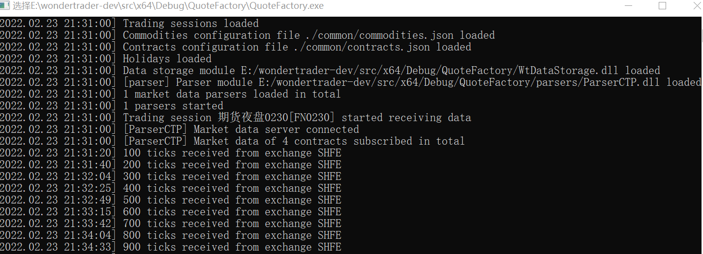

# 数据落地详解

source: `{{ page.path }}`

执行 `QuoteFactory` 下的 main.cpp

## 准备工作

### 1. 配置文件

- QFConfig.yaml 
- logcfgdt.yaml
- statemonitor.yaml
- common配置目录
  - sessions.json"
  - commodities.json"
  - contracts.json"
  - holidays.json"
  - hots.json"
- parsers文件目录
  - ParserCTP.dll
  - thostmduserapi_se.dll

QFConfig.yaml 样式

```yaml
# 配置文件目录
basefiles:        
    commodity: ./common/commodities.json
    contract: ./common/contract.json
    holiday: ./common/holidays.json
    session: ./common/sessions.json
# UDP配置
broadcaster:
    active: true
    sport: 3997
    broadcast:
    -   host: 255.255.255.255
        port: 9001
        type: 2
    multicast_:
    -   host: 224.169.169.169
        port: 9002
        sendport: 8997
        type: 0
    -   host: 224.169.169.169
        port: 9003
        sendport: 8998
        type: 1
    -   host: 224.169.169.169
        port: 9004
        sendport: 8999
        type: 2
# 行情配置
parsers:
-   active: true        # 该行情适配器是否可用
    id: parser          # 当前行情适配器id
    broker: '9999'    
    code: ''
    front: tcp://180.168.146.187:10211
    module: ParserCTP   # CTP行情解析dll文件
    pass: ******        # simnow 密码
    user: ******        # simnow 用户名
statemonitor: statemonitor.yaml
writer:
    async: true         # 是否异步执行
    groupsize: 100      # 每次存多少条tick数据
    path: ./FUT_Data    # 文件存储目录
    savelog: false
```

logcfgdt.yaml 样式

```yaml
parser:
    async: false
    level: debug
    sinks:
    -   filename: DtLogs/Parser.log
        pattern: '[%Y.%m.%d %H:%M:%S - %-5l] %v'
        truncate: false
        type: daily_file_sink
root:
    async: false
    level: debug
    sinks:
    -   filename: DtLogs/QuoteFact.log
        pattern: '[%Y.%m.%d %H:%M:%S - %-5l] %v'
        truncate: false
        type: daily_file_sink
    -   pattern: '[%m.%d %H:%M:%S - %^%-5l%$] %v'
        type: console_sink
```

statemonitor.yaml 样式

```yaml
FN0230:
    closetime: 1515
    inittime: 2050
    name: 期夜0230
    proctime: 1600
```

commodities.json 样式

```json
{
    "SHFE": {
        "au": {
            "covermode": 1,
            "pricemode": 1,
            "category": 1,
            "precision": 2,
            "pricetick": 0.02,
            "volscale": 1000,
            "name": "沪深",
            "exchg": "SHFE",
            "session": "FN0230",
            "holiday": "CHINA"
        }
    }
}
```

contracts.json 样式

```json
{
    "SHFE": {
        "au2203": {
            "name": "沪金2203",
            "code": "au2203",
            "exchg": "SHFE",
            "product": "au",
            "maxlimitqty": 500,
            "maxmarketqty": 30
        },
        "au2204": {
            "name": "沪金2204",
            "code": "au2204",
            "exchg": "SHFE",
            "product": "au",
            "maxlimitqty": 500,
            "maxmarketqty": 30
        },
        "au2205": {
            "name": "沪金2205",
            "code": "au2205",
            "exchg": "SHFE",
            "product": "au",
            "maxlimitqty": 500,
            "maxmarketqty": 30
        }
    }
}
```

holidays.json 样式

```json
{
    "CHINA": [
        "20220603",
        "20220912",
        "20221003",
        "20221004",
        "20221005",
        "20221006",
        "20221007"
    ]
}
```

hots.json 样式

```json
{
    "SHFE": {
        "au": [
            {
                "date": 20211123,
                "from": "au2112",
                "newclose": 380.38,
                "oldclose": 379.14,
                "to": "au2202"
            },
            {
                "date": 20211228,
                "from": "au2202",
                "newclose": 374.92,
                "oldclose": 373.44,
                "to": "au2206"
            }
        ]
    }
}
```

sessions.json 样式

```json
{
    "FN0230":{
        "name":"期货夜盘0230",
        "offset": 300,
        "auction":{
            "from": 2059,
            "to": 2100
        },
        "sections":[
            {
                "from": 2100,
                "to": 230
            },
            {
                "from": 900,
                "to": 1015
            },
            {
                "from": 1030,
                "to": 1130
            },
            {
                "from": 1330,
                "to": 1500
            }
        ]
    }
}
```

## 源码分析

程序主逻辑都在 `initialize()` 函数中

```cpp
void initialize()
{
	// 1. 设置工作目录
	WtHelper::set_module_dir(getBinDir());

	// 2. 加载配置文件
	std::string filename("QFConfig.json");
	if (!StdFile::exists(filename.c_str()))
		filename = "QFConfig.yaml";

	WTSVariant* config = WTSCfgLoader::load_from_file(filename.c_str(), true);
	if(config == NULL)
	{
		WTSLogger::error_f("Loading config file {} failed", filename);
		return;
	}

	// 3. 加载市场信息, 合约信息, 节假日配置文件
	WTSVariant* cfgBF = config->get("basefiles");
	bool isUTF8 = cfgBF->getBoolean("utf-8");
	if (cfgBF->get("session"))
	{
		g_baseDataMgr.loadSessions(cfgBF->getCString("session"), isUTF8);
		WTSLogger::info("Trading sessions loaded");
	}

	WTSVariant* cfgItem = cfgBF->get("commodity");
	if (cfgItem)
	{
		if (cfgItem->type() == WTSVariant::VT_String)
		{
			g_baseDataMgr.loadCommodities(cfgItem->asCString(), isUTF8);
		}
		else if (cfgItem->type() == WTSVariant::VT_Array)
		{
			for (uint32_t i = 0; i < cfgItem->size(); i++)
			{
				g_baseDataMgr.loadCommodities(cfgItem->get(i)->asCString(), isUTF8);
			}
		}
	}
	cfgItem = cfgBF->get("contract");
	if (cfgItem)
	{
		if (cfgItem->type() == WTSVariant::VT_String)
		{
			g_baseDataMgr.loadContracts(cfgItem->asCString(), isUTF8);
		}
		else if (cfgItem->type() == WTSVariant::VT_Array)
		{
			for (uint32_t i = 0; i < cfgItem->size(); i++)
			{
				g_baseDataMgr.loadContracts(cfgItem->get(i)->asCString(), isUTF8);
			}
		}
	}
	if (cfgBF->get("holiday"))
	{
		g_baseDataMgr.loadHolidays(cfgBF->getCString("holiday"));
		WTSLogger::info("Holidays loaded");
	}

	//By Wesley @ 2021.12.27
	// datakit不需要主力映射规则
	// 4. 初始化UDP对象(添加客户端和服务端)
	g_udpCaster.init(config->get("broadcaster"), &g_baseDataMgr, &g_dataMgr);

	//By Wesley @ 2021.12.27
	//全天候模式，不需要再使用状态机
	bool bAlldayMode = config->getBoolean("allday");
	if (!bAlldayMode)
	{
		// 5. 初始化状态机
		g_stateMon.initialize(config->getCString("statemonitor"), &g_baseDataMgr, &g_dataMgr);
	}
	else
	{
		WTSLogger::info("QuoteFactory will run in allday mode");
	}

	// 6. 初始化数据管理器
	initDataMgr(config->get("writer"), bAlldayMode);

	// 7. 初始化行情通道
	initParsers(config->get("parsers"));

	config->release();

	// 8. 添加线程执行任务(等待run()启动)
	g_asyncIO.post([bAlldayMode](){
		// 8.1 启动行情适配管理器
		g_parsers.run();

		//全天候模式，不启动状态机
		if(!bAlldayMode)
		{
			std::this_thread::sleep_for(std::chrono::milliseconds(5));
			// 8.2 启动状态机
			g_stateMon.run();
		}
	});
}
```

### 3. 初始化基础数据管理器

代码中的 g_baseDataMgr 是基础数据管理器, 主要加载各类配置文件

1. 加载 session 文件保存到 m_mapSessions(**初始化之后时间段都会被处理为偏移后的时间段**)
2. 加载 commodity 文件保存到 m_mapCommodities
3. 加载 contract 文件保存到 m_mapContracts
4. 加载 holiday 文件保存到 m_mapTradingDay

### 4. 初始化UDP广播对象

UDP广播内容大致能明白, 但描述可能不精确

```cpp
bool UDPCaster::init(WTSVariant* cfg, WTSBaseDataMgr* bdMgr, DataManager* dtMgr)
{
	m_bdMgr = bdMgr;
	m_dtMgr = dtMgr;

	// 通过配置文件 dtcfg.yaml 初始化对象
	if (!cfg->getBoolean("active"))
		return false;

	WTSVariant* cfgBC = cfg->get("broadcast");
	if (cfgBC)
	{
		for (uint32_t idx = 0; idx < cfgBC->size(); idx++)
		{
			WTSVariant* cfgItem = cfgBC->get(idx);
			// 1. 添加单广播客户端 1 V n
			addBRecver(cfgItem->getCString("host"), cfgItem->getInt32("port"), cfgItem->getUInt32("type"));
		}
	}
	WTSVariant* cfgMC = cfg->get("multicast");
	if (cfgMC)
	{
		for (uint32_t idx = 0; idx < cfgMC->size(); idx++)
		{
			WTSVariant* cfgItem = cfgMC->get(idx);
			// 2. 添加多广播客户端 n V n
			addMRecver(cfgItem->getCString("host"), cfgItem->getInt32("port"), cfgItem->getInt32("sendport"), cfgItem->getUInt32("type"));
		}
	}
	// 3. 添加单广播服务端 
	int32_t sport = cfg->getInt32("sport");
	if (sport == 0)
		sport = cfg->getInt32("bport");
	start(sport);
	return true;
}
```

### 5. 初始化状态机

主要将初始化的状态数据填充至 `_map` 中

```cpp
bool StateMonitor::initialize(const char* filename, WTSBaseDataMgr* bdMgr, DataManager* dtMgr)
{
	_bd_mgr = bdMgr;
	_dt_mgr = dtMgr;
	// 1. 加载配置文件 statemonitor.yaml
	if (!StdFile::exists(filename))
	{
		WTSLogger::error("State config file %s not exists", filename);
		return false;
	}
	WTSVariant* config = WTSCfgLoader::load_from_file(filename, true);
	if (config == NULL)
	{
		WTSLogger::error("Loading state config failed");
		return false;
	}
	auto keys = config->memberNames();
	for (const std::string& sid : keys)
	{
		// FN0230
		WTSVariant* jItem = config->get(sid.c_str());

		// 根据 sid 获取交易时段信息
		WTSSessionInfo* ssInfo = _bd_mgr->getSession(sid.c_str());
		if (ssInfo == NULL)
		{
			WTSLogger::error_f("Trading session template [{}] not exists,state control rule skipped", sid);
			continue;
		}
		// 2. 填充状态信息字段
		StatePtr sInfo(new StateInfo);
		sInfo->_init_time = jItem->getUInt32("inittime");	// 初始化时间,初始化以后数据才开始接收
		sInfo->_close_time = jItem->getUInt32("closetime");	// 收盘时间,收盘后数据不再接收了
		sInfo->_proc_time = jItem->getUInt32("proctime");	// 盘后处理时间,主要把实时数据转到历史去
		// 交易时段标志如 "FN0230"
		strcpy(sInfo->_session, sid.c_str());

		// 集合竞价的开始结束时间(偏移后)
		auto secInfo = ssInfo->getAuctionSection();			//这里面是偏移过的时间,要注意了!!!
		if (secInfo.first != 0 || secInfo.second != 0)
		{
			uint32_t stime = secInfo.first;
			uint32_t etime = secInfo.second;

			stime = stime / 100 * 60 + stime % 100;//先将时间转成分钟数
			etime = etime / 100 * 60 + etime % 100;

			stime = stime / 60 * 100 + stime % 60;//再将分钟数转成时间
			etime = etime / 60 * 100 + etime % 60;//先不考虑半夜12点的情况,目前看来,几乎没有
			sInfo->_sections.emplace_back(StateInfo::Section({ stime, etime }));
		}
		// 交易开始结束时间(偏移后)
		auto sections = ssInfo->getTradingSections();		//这里面是偏移过的时间,要注意了!!!
		for (auto it = sections.begin(); it != sections.end(); it++)
		{
			auto secInfo = *it;
			uint32_t stime = secInfo.first;
			uint32_t etime = secInfo.second;

			stime = stime / 100 * 60 + stime % 100;//先将时间转成分钟数
			etime = etime / 100 * 60 + etime % 100;

			stime--;//开始分钟数-1
			etime++;//结束分钟数+1

			stime = stime / 60 * 100 + stime % 60;//再将分钟数转成时间
			etime = etime / 60 * 100 + etime % 60;//先不考虑半夜12点的情况,目前看来,几乎没有
			sInfo->_sections.emplace_back(StateInfo::Section({ stime, etime }));
		}
		// 添加状态映射
		_map[sInfo->_session] = sInfo;

		CodeSet* pCommSet =  _bd_mgr->getSessionComms(sInfo->_session);
		if (pCommSet)
		{
			// 获取当前时间(偏移后)
			uint32_t curDate = TimeUtils::getCurDate();
			uint32_t curMin = TimeUtils::getCurMin() / 100;
			uint32_t offDate = ssInfo->getOffsetDate(curDate, curMin);
			uint32_t offMin = ssInfo->offsetTime(curMin, true);

			//先获取基准的交易日
			for (auto it = pCommSet->begin(); it != pCommSet->end(); it++)
			{
				const char* pid = (*it).c_str();
				// 设置交易日
				 _bd_mgr->setTradingDate(pid,  _bd_mgr->getTradingDate(pid, offDate, offMin, false), false);
				uint32_t prevDate = TimeUtils::getNextDate(curDate, -1);
				// 时间偏移 > 0, 当前真实值不是交易日, ... || 时间偏移小于0, 当前偏移值不是交易日
				if ((ssInfo->getOffsetMins() > 0 &&
					(! _bd_mgr->isTradingDate(pid, curDate) &&
					!(ssInfo->isInTradingTime(curMin) &&  _bd_mgr->isTradingDate(pid, prevDate)))) ||
					(ssInfo->getOffsetMins() <= 0 && ! _bd_mgr->isTradingDate(pid, offDate))
					)
				{
					WTSLogger::info_f("Instrument {} is in holiday", pid);
				}
			}
		}
	}
	return true;
}
```

### 6. 初始化数据管理器

主要是加载输出写入dll文件, 并初始化数据写入器

```cpp
bool DataManager::init(WTSVariant* params, WTSBaseDataMgr* bdMgr, StateMonitor* stMonitor, UDPCaster* caster /* = NULL */)
{
	// 添加对象
	_bd_mgr = bdMgr;
	_state_mon = stMonitor;
	_udp_caster = caster;

	// 应该有一个配置: module: WtDataStorage.dll
	std::string module = params->getCString("module");
	if (module.empty())
		module = WtHelper::get_module_dir() + DLLHelper::wrap_module("WtDataStorage");
	else
		module = WtHelper::get_module_dir() + DLLHelper::wrap_module(module.c_str());
	DllHandle libParser = DLLHelper::load_library(module.c_str());
	if (libParser)
	{
		FuncCreateWriter pFuncCreateWriter = (FuncCreateWriter)DLLHelper::get_symbol(libParser, "createWriter");
		if (pFuncCreateWriter == NULL)
		{
			WTSLogger::error("Initializing of data writer failed: function createWriter not found...");
		}
		FuncDeleteWriter pFuncDeleteWriter = (FuncDeleteWriter)DLLHelper::get_symbol(libParser, "deleteWriter");
		if (pFuncDeleteWriter == NULL)
		{
			WTSLogger::error("Initializing of data writer failed: function deleteWriter not found...");
		}
		if (pFuncCreateWriter && pFuncDeleteWriter)
		{
			_writer = pFuncCreateWriter();
			_remover = pFuncDeleteWriter;
		}
		WTSLogger::info_f("Data storage module {} loaded", module.c_str());
	}
	else
	{
		WTSLogger::error("Initializing of data writer failed: loading module %s failed...", module.c_str());
	}
	// 1. 初始化数据写入器
	return _writer->init(params, this);
}
```

**1. 初始化数据写入器**

```cpp

// 数据写入初始化
bool WtDataWriter::init(WTSVariant* params, IDataWriterSink* sink)
{
	IDataWriter::init(params, sink);

	// 1. 获取基础数据管理器对象
	_bd_mgr = sink->getBDMgr();
	// 2. 是否保存日志
	_save_tick_log = params->getBoolean("savelog");
	// 3. 获取工作路径
	_base_dir = StrUtil::standardisePath(params->getCString("path"));
	if (!BoostFile::exists(_base_dir.c_str()))
		BoostFile::create_directories(_base_dir.c_str());
	// 4. 获取数据缓存文件名数据缓存文件
	_cache_file = params->getCString("cache");
	if (_cache_file.empty())
		_cache_file = "cache.dmb";

	// 5. 其他配置文件
	_async_proc = params->getBoolean("async");
	_log_group_size = params->getUInt32("groupsize");
	_disable_tick = params->getBoolean("disabletick");
	_disable_min1 = params->getBoolean("disablemin1");
	_disable_min5 = params->getBoolean("disablemin5");
	_disable_day = params->getBoolean("disableday");
	_disable_trans = params->getBoolean("disabletrans");
	_disable_ordque = params->getBoolean("disableordque");
	_disable_orddtl = params->getBoolean("disableorddtl");
	{
		// 加载 marker.ini
		std::string filename = _base_dir + MARKER_FILE;		// "marker.ini"
		IniHelper iniHelper;
		iniHelper.load(filename.c_str());
		StringVector ayKeys, ayVals;
		iniHelper.readSecKeyValArray("markers", ayKeys, ayVals);
		for (uint32_t idx = 0; idx < ayKeys.size(); idx++)
		{
			_proc_date[ayKeys[idx].c_str()] = strtoul(ayVals[idx].c_str(), 0, 10);
		}
	}
	loadCache();
	// 6. 线程绑定新的任务: check_loop
	_proc_chk.reset(new StdThread(boost::bind(&WtDataWriter::check_loop, this)));
	return true;
}
```

### 7. 初始化行情通道

主要是根据配置初始化行情适配器, 并将行情适配器添加到行情适配管理器中

```cpp
void initParsers(WTSVariant* cfg)
{
	for (uint32_t idx = 0; idx < cfg->size(); idx++)
	{
		WTSVariant* cfgItem = cfg->get(idx);
		if (!cfgItem->getBoolean("active"))
			continue;
		const char* id = cfgItem->getCString("id");

		std::string realid = id;
		if (realid.empty())
		{
			static uint32_t auto_parserid = 1000;
			realid = StrUtil::printf("auto_parser_%u", auto_parserid++);
		}
		// 1. 初始化行情适配器
		ParserAdapterPtr adapter(new ParserAdapter(&g_baseDataMgr, &g_dataMgr));
		adapter->init(realid.c_str(), cfgItem);
		// 2. 将行情适配器添加到行情适配管理器
		g_parsers.addAdapter(realid.c_str(), adapter);
	}
	WTSLogger::info("%u market data parsers loaded in total", g_parsers.size());
}
```

**1. 初始化行情适配器**

```cpp
bool ParserAdapter::init(const char* id, WTSVariant* cfg)
{
	if (cfg == NULL)
		return false;
	_id = id;	// 行情适配器id

	if (_cfg != NULL)
		return false;

	_cfg = cfg;
	_cfg->retain();

	{
		if (cfg->getString("module").empty())
			return false;

		std::string module = DLLHelper::wrap_module(cfg->getCString("module"), "lib");;

		if (!StdFile::exists(module.c_str()))
		{
			module = WtHelper::get_module_dir();
			module += "parsers/";
			module += DLLHelper::wrap_module(cfg->getCString("module"), "lib");
		}

		// 1. 加载行情解析模块 ParserCTP.dll
		DllHandle hInst = DLLHelper::load_library(module.c_str());
		if (hInst == NULL)
		{
			WTSLogger::log_dyn("parser", _id.c_str(), LL_ERROR, "[%s] Parser module %s loading failed", _id.c_str(), module.c_str());
			return false;
		}
		else
		{
			WTSLogger::log_dyn("parser", _id.c_str(), LL_INFO, "[%s] Parser module %s loaded", _id.c_str(), module.c_str());
		}

		FuncCreateParser pFuncCreateParser = (FuncCreateParser)DLLHelper::get_symbol(hInst, "createParser");
		if (NULL == pFuncCreateParser)
		{
			WTSLogger::log_dyn("parser", _id.c_str(), LL_FATAL, "[%s] Entrance function createParser not found", _id.c_str());
			return false;
		}

		_parser_api = pFuncCreateParser();
		if (NULL == _parser_api)
		{
			WTSLogger::log_dyn("parser", _id.c_str(), LL_FATAL, "[%s] Creating parser api failed", _id.c_str());
			return false;
		}
		_remover = (FuncDeleteParser)DLLHelper::get_symbol(hInst, "deleteParser");
	}

	// 2. 加载过滤条件
	const std::string& strFilter = cfg->getString("filter");
	if (!strFilter.empty())
	{
		const StringVector &ayFilter = StrUtil::split(strFilter, ",");
		auto it = ayFilter.begin();
		for (; it != ayFilter.end(); it++)
		{
			_exchg_filter.insert(*it);
		}
	}
	std::string strCodes = cfg->getString("code");
	if (!strCodes.empty())
	{
		const StringVector &ayCodes = StrUtil::split(strCodes, ",");
		auto it = ayCodes.begin();
		for (; it != ayCodes.end(); it++)
		{
			_code_filter.insert(*it);
		}
	}

	if (_parser_api)
	{
		// 3. 注册回调接口
		_parser_api->registerSpi(this);
		if (_parser_api->init(cfg))
		{
			ContractSet contractSet;		// 合约订阅列表
			if (!_code_filter.empty())		//优先判断合约过滤器
			{
				ExchgFilter::iterator it = _code_filter.begin();
				for (; it != _code_filter.end(); it++)
				{
					//全代码,形式如SSE.600000,期货代码为CFFEX.IF2005
					std::string code, exchg;
					auto ay = StrUtil::split((*it).c_str(), ".");
					if (ay.size() == 1)
						code = ay[0];
					else
					{
						exchg = ay[0];
						code = ay[1];
					}
					WTSContractInfo* contract = _bd_mgr->getContract(code.c_str(), exchg.c_str());
					WTSCommodityInfo* pCommInfo = _bd_mgr->getCommodity(contract);
					contractSet.insert(contract->getFullCode());
				}
			}
			else if (!_exchg_filter.empty())
			{
				ExchgFilter::iterator it = _exchg_filter.begin();
				for (; it != _exchg_filter.end(); it++)
				{
					WTSArray* ayContract = _bd_mgr->getContracts((*it).c_str());
					WTSArray::Iterator it = ayContract->begin();
					for (; it != ayContract->end(); it++)
					{
						WTSContractInfo* contract = STATIC_CONVERT(*it, WTSContractInfo*);
						WTSCommodityInfo* pCommInfo = _bd_mgr->getCommodity(contract);
						contractSet.insert(contract->getFullCode());
					}
					ayContract->release();
				}
			}
			else
			{
				WTSArray* ayContract = _bd_mgr->getContracts();
				WTSArray::Iterator it = ayContract->begin();
				for (; it != ayContract->end(); it++)
				{
					WTSContractInfo* contract = STATIC_CONVERT(*it, WTSContractInfo*);
					WTSCommodityInfo* pCommInfo = _bd_mgr->getCommodity(contract);
					contractSet.insert(contract->getFullCode());
				}
				ayContract->release();
			}

			_parser_api->subscribe(contractSet);
			contractSet.clear();
		}
		else
		{
			WTSLogger::log_dyn("parser", _id.c_str(), LL_ERROR, "[%s] Parser initializing failed: api initializing failed...", _id.c_str());
		}
	}
	else
	{
		WTSLogger::log_dyn("parser", _id.c_str(), LL_ERROR, "[%s] Parser initializing failed: creating api failed...", _id.c_str());
	}
	return true;
}
```

### 8.1 启动行情适配管理器

调用路径
- `ParserAdapter::run()`
- `ParserCTP::connect()`
- `m_pUserAPI->Init();`

行情接口连接成功

## 成功界面

在**开盘期间**运行程序, 如果出现如下界面, 说明程序运行成功



## 文件写入本地逻辑

数据如何写入到本地?

### 1. 文件梳理
关于行情模块有很多文件:

- IParserApi          行情解析器接口
- ParserCTP           CTP行情解析器         
- ParserAdapter       行情适配器
- ParserAdapterMgr    行情适配管理器

他们之间的关系:
- `IParserApi`是各类行情解析器总接口类
- `ParserCTP` 专门用于解析 CTP 接口(包括回调)
- `ParserAdapter` 是各类解析CTP接口的适配器
- `ParserAdapterMgr` 用于管理多个适配器

相互调用:
- `ParserCTP` 继承自 `IParserApi` 和 `CThostFtdcMdSpi`
- `ParserAdapter` 继承自 `IParserSpi`
- `ParserAdapter` 中的 `_parser_api` 是 `ParserCTP`
- `ParserCTP` 中的 `m_sink` 是 `ParserAdapter`

### 2. 行情代码执行顺序

1.main.cpp文件

```cpp
// 初始化行情适配器
adapter->init(realid.c_str(), cfgItem);
```

2.ParserAdapter.cpp

```cpp
// 初始化CTP行情解析器
_parser_api->init(cfg)
```

3.ParserCTP.cpp

```cpp
// 将 ParserCTP 注册为行情回调接口
m_pUserAPI->RegisterSpi(this);
```

4.当接口获取到行情数据时, 回调

```cpp
void ParserCTP::OnRtnDepthMarketData( CThostFtdcDepthMarketDataField *pDepthMarketData )
{
	...
	// m_sink == ParserAdapter
	if(m_sink)
		m_sink->handleQuote(tick, 1);

}
```

5.ParserAdapter.cpp

```cpp
void ParserAdapter::handleQuote( WTSTickData *quote, uint32_t procFlag )
{
	// _dt_mgr == DataManager
	if (!_dt_mgr->writeTick(quote, procFlag))
		return;
}
```

6.DataManager.cpp

```cpp
bool DataManager::writeTick(WTSTickData* curTick, uint32_t procFlag)
{
	// _writer == WtDataWriter
	return _writer->writeTick(curTick, procFlag);
}
```

7.WtDataWriter.cpp

```cpp
//写到tick缓存
if(!_disable_tick)
	pipeToTicks(ct, curTick);
```