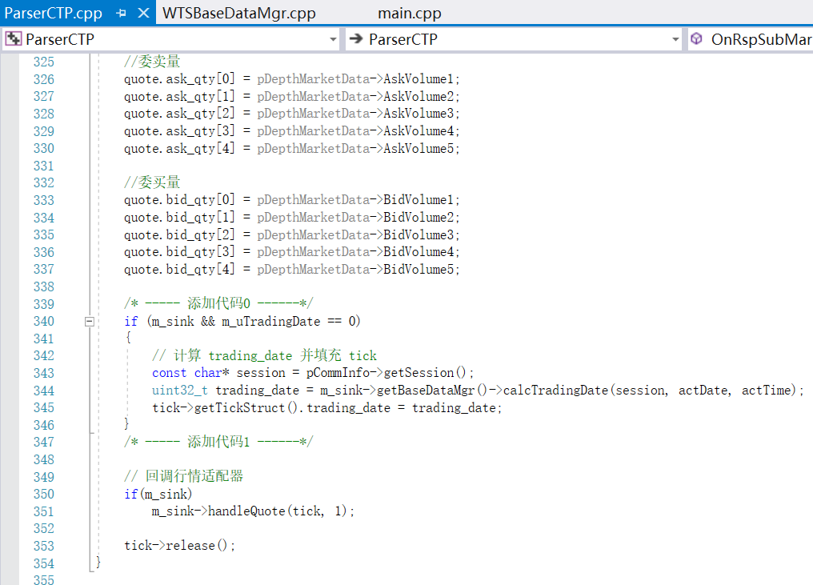
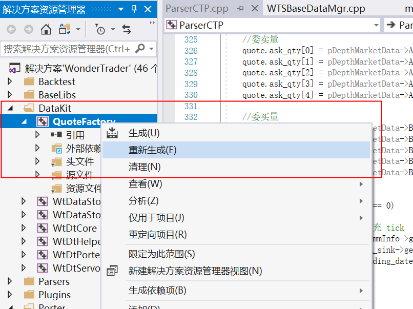
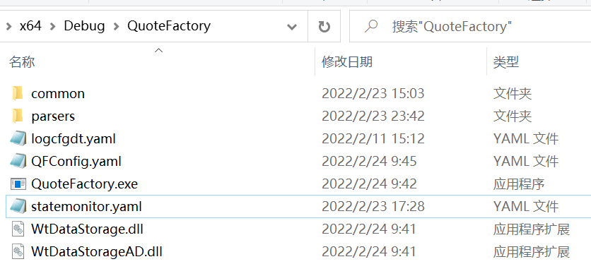
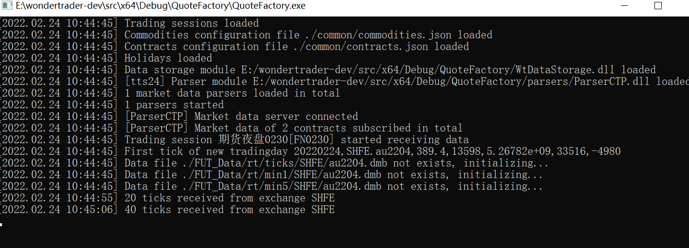
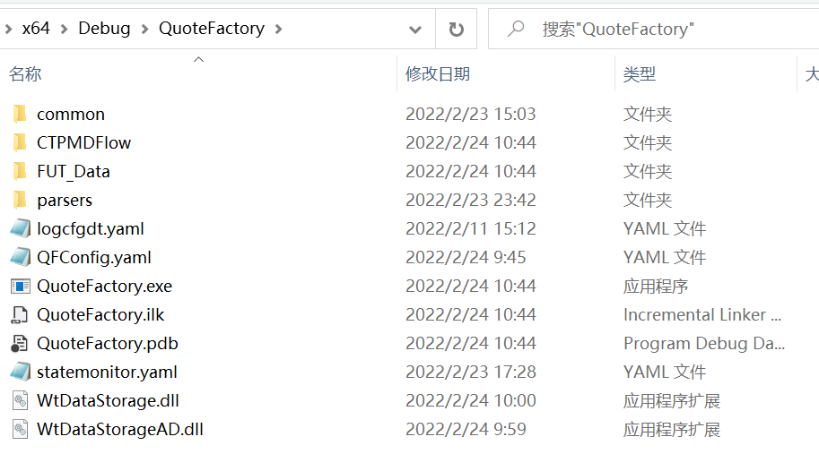

# 对接 openctp 仿真

source: `{{ page.path }}`

## openctp 介绍:

[CTP开放平台提供A股、港股、美股、期货、期权等全品种接入通道，通过提供中泰证券XTP、华鑫证券奇点、东方证券OST、盈透证券TWS等各通道的CTPAPI接口，CTP程序可以无缝对接各股票柜台。平台也提供了一套基于TTS交易系统的模拟环境，同样提供了CTPAPI兼容接口，可以替代Simnow，为CTP量化交易开发者提供7x24可用的模拟环境。](https://github.com/dumengru/openctp)

## 对接openctp仿真注意事项

**openctp** 是极为优秀的仿真测试项目, 原本只要将ctp的两个dll文件替换掉就可以直接做仿真交易, 但 **openctp**的行情数据返回没有 `trading_date` 这个字段, 而 WonderTrader 项目中处理行情很多地方需要用 `trading_date` 做判断, 因此需要手动处理这个字段才能使用 `openctp` 做仿真交易.

## 准备好修改源码了嘛?

1.打开 "src\ParserCTP\ParserCTP.cpp"

2.找到函数 `ParserCTP::OnRtnDepthMarketData`

3.在改函数中添加代码

- 逻辑: 如果 m_uTradingDate == 0, 则手动计算trading_date并填充

```cpp
/* ----- 添加代码0 ------*/
if (m_sink && m_uTradingDate == 0)
{
    // 计算 trading_date 并填充 tick
    const char* session = pCommInfo->getSession();
    uint32_t trading_date = m_sink->getBaseDataMgr()->calcTradingDate(session, actDate, actTime);
    quote.trading_date = trading_date;
}
/* ----- 添加代码1 ------*/

// 回调行情适配器
if(m_sink)
    m_sink->handleQuote(tick, 1);

tick->release();
```

```tip
为何可以这么改? 建议查看文章 "数据落地" 深入了解
```

4.图片展示



5.重新编译



## 部署openctp环境

### 准备工作

#### 1. 配置文件

- QFConfig.yaml 
- logcfgdt.yaml
- statemonitor.yaml
- common配置目录
  - sessions.json"
  - commodities.json"
  - contracts.json"
  - holidays.json"
  - hots.json"
- parsers文件目录
  - ParserCTP.dll
  - tts_thostmduserapi_se.dll(后面有添加方式)

QFConfig.yaml 样式

```yaml
basefiles:
    commodity: ./common/commodities.json
    contract: ./common/contracts.json
    holiday: ./common/holidays.json
    session: ./common/sessions.json
broadcaster:
    active: true
    bport: 3997
    broadcast:
    -   host: 255.255.255.255
        port: 9001
        type: 2
    multicast_:
    -   host: 224.169.169.169
        port: 9002
        sendport: 8997
        type: 0
    -   host: 224.169.169.169
        port: 9003
        sendport: 8998
        type: 1
    -   host: 224.169.169.169
        port: 9004
        sendport: 8999
        type: 2
parsers:
 # 一般环境
-   active: true   # 是否启动改环境
    broker: 
    id: tts
    module: ParserCTP
    front: tcp://121.36.146.182:20004
    ctpmodule: tts_thostmduserapi_se
    # 去 openctp 项目网站查看申请方式
    pass: ******
    user: ******
    # 只接收 au 行情
    code: SHFE.au2204,SHFE.au2205
# 7*24 小时环境
-   active: false
    broker: 
    id: tts24       
    module: ParserCTP
    front: tcp://122.51.136.165:20004
    ctpmodule: tts_thostmduserapi_se
    # 去 openctp 项目网站查看申请方式
    pass: ******
    user: ******
    # 只接收 au 行情
    code: SHFE.au2204,SHFE.au2205

statemonitor: statemonitor.yaml
writer:
    module: WtDataStorage
    async: true
    groupsize: 20       # 每次接收20个tick
    path: ./FUT_Data    # 数据保存路径
    savelog: false
```

logcfgdt.yaml 样式

```yaml
parser:
    async: false
    level: debug
    sinks:
    -   filename: DtLogs/Parser.log
        pattern: '[%Y.%m.%d %H:%M:%S - %-5l] %v'
        truncate: false
        type: daily_file_sink
root:
    async: false
    level: debug
    sinks:
    -   filename: DtLogs/QuoteFact.log
        pattern: '[%Y.%m.%d %H:%M:%S - %-5l] %v'
        truncate: false
        type: daily_file_sink
    -   pattern: '[%m.%d %H:%M:%S - %^%-5l%$] %v'
        type: console_sink
```

statemonitor.yaml 样式
(如果使用7*24小时环境可能需要修改)
```yaml
FN0230:
    closetime: 1515     # 收盘时间,收盘后数据不再接收了
    inittime: 2050      # 初始化时间,初始化以后数据才开始接收
    name: 期夜0230
    proctime: 1600      # 盘后处理时间,主要把实时数据转到历史去
```

#### 2. 添加 tts_thostmduserapi_se.dll

1.进入 openctp 项目网站, 下载对应版本的 dll文件


2.将 `thostmduserapi_se.dll` 改名为 `tts_thostmduserapi_se.dll`(这里只用到行情dll), 并放到 "Debug\QuoteFactory\parsers" 目录下

#### 3. 确认修改成功

原始目录大致是这样


**运行 "QuoteFactory/main.cpp" 程序**

行情界面如下


新目录如下


