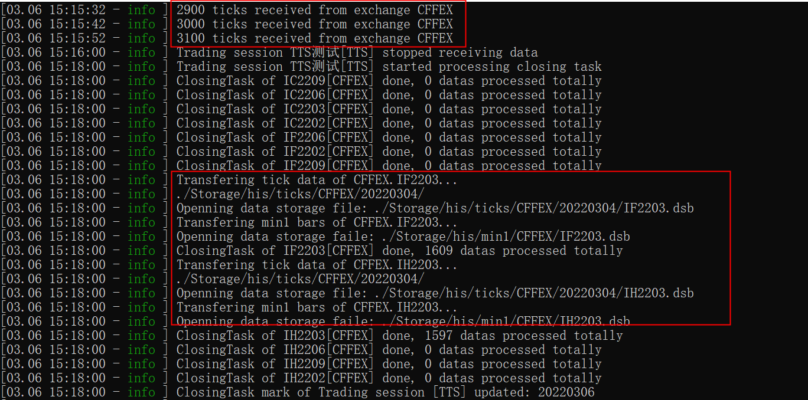

# 状态机详解

source: `{{ page.path }}`

执行 `TestDtPorter` 下的 main.cpp

在文章 "UDP数据转发" 中我们使用的是7*24小时环境, 没有执行状态机, 因此无法模拟收盘作业

**收盘作业**

顾名思义，在每个交易日结束以后，会对行情数据做一个盘后处理，这个处理的过程就叫做收盘作业。收盘作业主要包括以下工作：
- 将实时高频数据按天按代码压缩存放(`tick`和`level2`高频数据)
- 将当日的K线数据(`min1`和`min5`)合并到历史K线数据中
- 根据当天最新的`tick`数据，生成当天的日K线数据并合并到历史日K线数据中

## 准备工作

由于状态机设了很多限制, 对节日或收盘时间检查非常严格(这在实盘当然是好事), 但是对测试而言十分不友好, 因此以下内容建议在开盘期间测试.

### 1. 配置文件

- dtcfg.yaml
- logcfgdt.yaml
- statemonitor.yaml
- mdparsers.yaml
- common配置目录
  - sessions.json"
  - commodities.json"
  - contracts.json"
  - holidays.json"
- parsers文件目录
  - ParserCTP.dll
  - thostmduserapi_se.dll

dtcfg.yaml 样式

```yaml
basefiles:
    utf-8: true     # 配置文件是否使用utf-8编码
    commodity: ./common/commodities.json
    contract: ./common/contracts.json
    holiday: ./common/holidays.json
    session: ./common/sessions.json
broadcaster:
    active: true
    bport: 3997         # UDP转发端口
    broadcast:
    -   host: 255.255.255.255
        port: 9001
        type: 2
    multicast_:
    -   host: 224.169.169.169
        port: 9002
        sendport: 8997
        type: 0
    -   host: 224.169.169.169
        port: 9003
        sendport: 8998
        type: 1
    -   host: 224.169.169.169
        port: 9004
        sendport: 8999
        type: 2
# allday: true        # 注释或删除, 否则不执行状态机
parsers: mdparsers.yaml
statemonitor: statemonitor.yaml
writer:
    async: true
    groupsize: 100          # 每次接收多少条数据
    path: ./Storage        # 数据保存文件夹
    savelog: true
```

mdparsers.yaml

```yaml
parsers:
-   active: true
    broker: ""
    id: tts24
    module: ParserCTP
    front: tcp://122.51.136.165:20004
    ctpmodule: tts_thostmduserapi_se
    pass: ******
    user: ******
    code: CFFEX.IC2203,CFFEX.IF2203,CFFEX.IH2203 # 只接收指定合约数据
    # filter: SHFE,CZCE   # 只接收指定交易所数据
```

statemonitor.yaml 样式

```yaml
FD0900:               # 该字段和session.json文件一一对应
    closetime: 1515   # 收盘时间
    inittime: 850     # 数据初始化时间, 准备开盘
    name: 期白0900
    proctime: 1600    # 收盘作业时间
FD0915:
    closetime: 1530
    inittime: 900
    name: 期白0915
    proctime: 1600
```

## 配置详解

### dtcfg.yaml

1. allday, 这个对测试很重要, 因为如果打开这个, wt会自动屏蔽使用状态机, 记得删除或关闭.

### mdparsers.yaml

1. broker: "", 可以为空字符串, 但是一定要写, (因为本人常犯此错, 所以记录下)

### statemonitor.yaml

注意 proctime 这个时间点, 当前时间大于这个时间便开始收盘作业

## 代码注释

`main.cpp` 主要通过 `WtDtPorter.cpp` 调用了 `WtDtRunner.cpp` 中的 `WtDtRunner::initialize` 和 `WtDtRunner::start` 方法.其他代码注释参考文章 "UDP数据转发", 使用状态机只有两句代码

### _state_mon.initialize

主要操作就是加载 `statemonitor.yaml` 文件, 并和 `session.json` 文件中的内容一一对应起来, 并将所有信息添加到映射 `_map` 中

```cpp
// 初始化状态机
bool StateMonitor::initialize(const char* filename, WTSBaseDataMgr* bdMgr, DataManager* dtMgr)
{
	_bd_mgr = bdMgr;
	_dt_mgr = dtMgr;

	// 1. 加载配置文件
	WTSVariant* config = WTSCfgLoader::load_from_file(filename, true);

	auto keys = config->memberNames();
	for (const std::string& sid : keys)
	{
		WTSVariant* jItem = config->get(sid.c_str());
		// 2. 获取交易时间段信息
		WTSSessionInfo* ssInfo = _bd_mgr->getSession(sid.c_str());
		if (ssInfo == NULL)
		{
			WTSLogger::error_f("Trading session template [{}] not exists,state control rule skipped", sid);
			continue;
		}

		// 3. 创建状态信息并填充
		StatePtr sInfo(new StateInfo);
		sInfo->_init_time = jItem->getUInt32("inittime");	//初始化时间,初始化以后数据才开始接收
		sInfo->_close_time = jItem->getUInt32("closetime");	//收盘时间,收盘后数据不再接收了
		sInfo->_proc_time = jItem->getUInt32("proctime");	//盘后处理时间,主要把实时数据转到历史去

		strcpy(sInfo->_session, sid.c_str());
		// 4. 填充集合竞价时间段
		auto secInfo = ssInfo->getAuctionSection();//这里面是偏移过的时间,要注意了!!!
		if (secInfo.first != 0 || secInfo.second != 0)
		{}
		// 5. 填充交易时间段
		auto sections = ssInfo->getTradingSections();//这里面是偏移过的时间,要注意了!!!
		for (auto it = sections.begin(); it != sections.end(); it++)
		{}
		// 6. 将状态信息添加到映射 _map 中
		_map[sInfo->_session] = sInfo;
		// 7. 判断对应合约是否在假日
		CodeSet* pCommSet =  _bd_mgr->getSessionComms(sInfo->_session);
		if (pCommSet)
		{
      {
				/* 
					 (offset>0, curDate不在交易时间, (curmin不在交易时间 || prevDate不在交易日期)
					 (offset<=0, offDate不在交易日)
				*/
				if ((ssInfo->getOffsetMins() > 0 &&
					(! _bd_mgr->isTradingDate(pid, curDate) &&
					!(ssInfo->isInTradingTime(curMin) &&  _bd_mgr->isTradingDate(pid, prevDate)))) ||
					(ssInfo->getOffsetMins() <= 0 && ! _bd_mgr->isTradingDate(pid, offDate))
					)
				{
					WTSLogger::info_f("Instrument {} is in holiday", pid);
				}
			}
		}
	}
	return true;
}
```

### _state_mon.run

这段代码较长, 基本上就是通过时间判断当前所处的交易状态, 与收盘作业密切相关的只有以下两段代码. 不管是盘中还是收盘作业中, 牵涉到数据写入都与 `WtDataWriter.cpp` 有关

```cpp
case SS_CLOSED:
  {
    uint32_t offTime = mInfo->offsetTime(curMin, true);
    uint32_t offProcTime = mInfo->offsetTime(sInfo->_proc_time, true);
    if (offTime >= offProcTime)
    {
      // 1. 收盘作业是否已完成
      if(!_dt_mgr->isSessionProceeded(sInfo->_session))
      {
        // 收盘 -> 收盘作业
        sInfo->_state = SS_PROCING;
        WTSLogger::info_f("Trading session {}[{}] started processing closing task", mInfo->name(), sInfo->_session);
        // 2. 数据转存储
        _dt_mgr->transHisData(sInfo->_session);
      }
      else
      {
        // 收盘 -> 已处理
        sInfo->_state = SS_PROCED;
      }
    }

// ...

// 状态在==收盘作业!=节日
if (isAllInState(SS_PROCING) && !isAllInState(SS_Holiday))
{
  // 3. 缓存清理
  _dt_mgr->transHisData("CMD_CLEAR_CACHE");
}
```

#### 1. 收盘作业是否已完成

进入 `WtDataWriter.cpp`

`_dt_mgr->isSessionProceeded` -> `_writer->isSessionProceeded` -> `WtDataWriter::isSessionProceeded`

```cpp
// _proc 即Storage/marker.ini内容
auto it = _proc_date.find(sid);
if (it == _proc_date.end())
  return false;

// .ini内日期>=当前日期, 说明收盘作业已完成
return (it->second >= TimeUtils::getCurDate());
```

#### 2. 数据转存储

进入 `WtDataWriter.cpp`

`_dt_mgr->transHisData` -> `_writer->transHisData` -> `WtDataWriter::transHisData`

这里会启动一个线程, 执行 `proc_loop`, 进行真正的收盘作业

```cpp
	if (_proc_thrd == NULL)
	{
		_proc_thrd.reset(new StdThread(boost::bind(&WtDataWriter::proc_loop, this)));
	}
```

#### 清理缓存

进入 `WtDataWriter.cpp`, 处理清理缓存内容, 还会更新 `Storage/marker.ini`, 说明收盘作业已完成

```cpp
else if (StrUtil::startsWith(fullcode, "MARK.", false))
{
  //如果指令以MARK.开头,说明是标记指令,要写一条标记
  std::string filename = _base_dir + MARKER_FILE;
  std::string sid = fullcode.substr(5);
  uint32_t curDate = TimeUtils::getCurDate();
  IniHelper iniHelper;
  iniHelper.load(filename.c_str());
  iniHelper.writeInt("markers", sid.c_str(), curDate);
  iniHelper.save();
  pipe_writer_log(_sink, LL_INFO, "ClosingTask mark of Trading session [{}] updated: {}", sid.c_str(), curDate);
}
```

## 成功验证

成功执行收盘作业后会出现 `Storage/his` 文件夹, 保存各类 dsb文件
