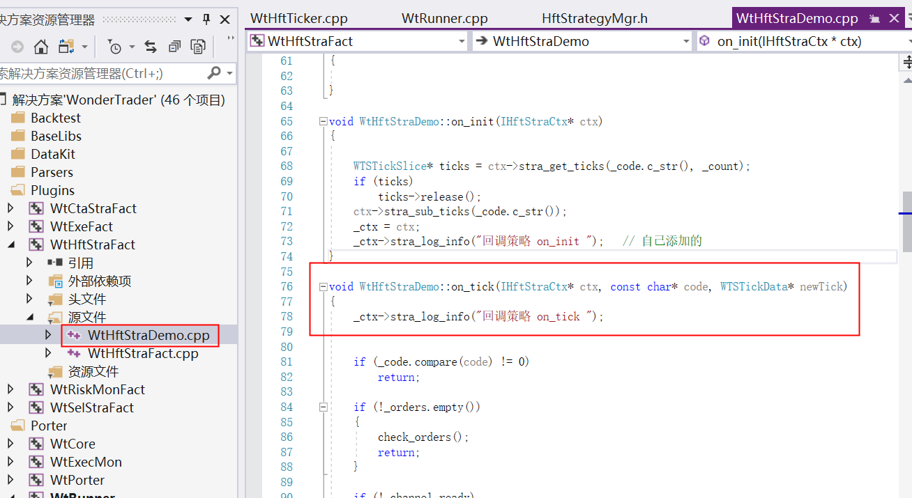
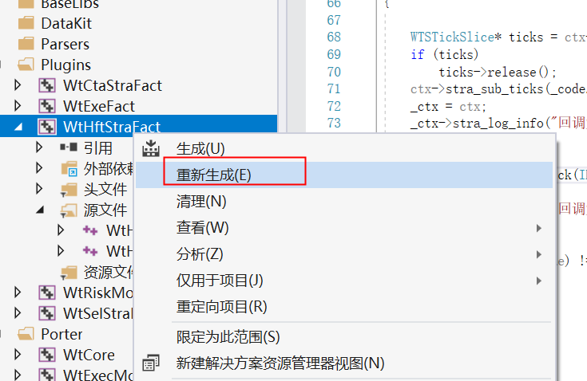
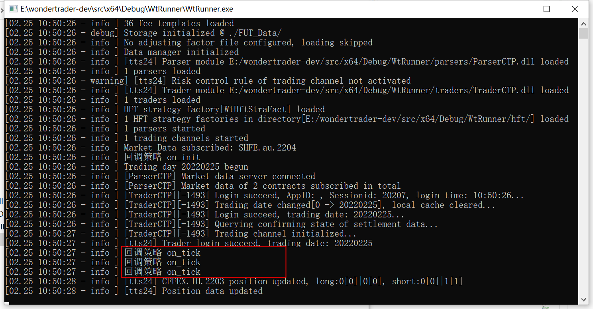

# HFT仿真详解

source: `{{ page.path }}`

## 准备工作

### 需要先完成`生成解决方案`

### 1. 配置文件
- logcfg.yaml 
- config.yaml
- filters.yaml
- actpolicy.yaml
- WtDataStorage.dll
- WtRiskMonFact.dll
- common配置目录
  - sessions.json"
  - commodities.json"
  - contracts.json"
  - holidays.json"
  - hots.json"
- hft策略文件目录
  - WtHftStraFact.dll
- parsers行情文件目录
  - ParserCTP.dll
  - tts_thostmduserapi_se.dll
- traders交易文件目录
  - TraderCTP.dll
  - thosttraderapi_se.dll

config.yaml样式
```yaml
basefiles:
    session: ./common/sessions.json
    commodity: ./common/commodities.json
    contract: ./common/contracts.json
    holiday: ./common/holidays.json
    hot: ./common/hots.json
    utf-8: false
env:
    name: hft       # 确定交易引擎类型
    mode: product
    filters: filters.yaml
    fees: ./common/fees.json
    product: 
        session: FN0230   # 为时间步进器提供
bspolicy: actpolicy.yaml
data:
    store:
        path: ./FUT_Data/
strategies:
    hft:
    -   active: true
        id: hft_demo
        name: WtHftStraFact.HftDemoStrategy
        params:
            code: SHFE.au.2204	#  注意格式
            count: 10
            second: 10
            offset: 1
            count: 50
            stock: false
        trader: tts24
traders:
-   active: false
    id: tts
    module: TraderCTP
    ctpmodule: tts_thosttraderapi_se
    front: tcp://121.36.146.182:20002
    broker: 
    user: 1493
    pass: 123456
    appid:
    authcode:
    quick: true
    riskmon:
        active: false
        policy:
            default:
                order_times_boundary: 20
                order_stat_timespan: 10
                cancel_times_boundary: 20
                cancel_stat_timespan: 10
                cancel_total_limits: 470
-   active: true
    id: tts24
    module: TraderCTP
    ctpmodule: tts_thosttraderapi_se
    front: tcp://122.51.136.165:20002
    broker: 
    user: 1493
    pass: 123456
    appid:
    authcode:
    quick: true
    riskmon:
        active: false
        policy:
            default:
                order_times_boundary: 20
                order_stat_timespan: 10
                cancel_times_boundary: 20
                cancel_stat_timespan: 10
                cancel_total_limits: 470
parsers:
-   active: false
    broker: 
    id: tts
    module: ParserCTP
    front: tcp://121.36.146.182:20004
    ctpmodule: tts_thostmduserapi_se
    pass: 123456
    user: 1493
    code: SHFE.au2204,SHFE.au2205
-   active: true
    broker: 
    id: tts24
    module: ParserCTP
    front: tcp://122.51.136.165:20004
    ctpmodule: tts_thostmduserapi_se
    pass: 123456
    user: 1493
    code: SHFE.au2204,SHFE.au2205
```

logcfg.yaml样式
```cpp
dyn_pattern:
    executer:
        async: false
        level: debug
        sinks:
        -   filename: Logs/Executer_%s.log
            pattern: '[%Y.%m.%d %H:%M:%S - %-5l] %v'
            truncate: true
            type: daily_file_sink
    parser:
        async: false
        level: debug
        sinks:
        -   filename: Logs/Parser_%s.log
            pattern: '[%Y.%m.%d %H:%M:%S - %-5l] %v'
            truncate: true
            type: daily_file_sink
    strategy:
        async: false
        level: debug
        sinks:
        -   filename: Logs/Strategy/%s.log
            pattern: '[%Y.%m.%d %H:%M:%S - %-5l] %v'
            truncate: true
            type: daily_file_sink
    trader:
        async: false
        level: debug
        sinks:
        -   filename: Logs/Trader_%s.log
            pattern: '[%Y.%m.%d %H:%M:%S - %-5l] %v'
            truncate: true
            type: daily_file_sink
risk:
    async: false
    level: debug
    sinks:
    -   filename: Logs/Riskmon.log
        pattern: '[%Y.%m.%d %H:%M:%S - %-5l] %v'
        truncate: true
        type: daily_file_sink
root:
    async: false
    level: debug
    sinks:
    -   filename: Logs/Runner.log
        pattern: '[%Y.%m.%d %H:%M:%S - %-5l] %v'
        truncate: true
        type: daily_file_sink
    -   pattern: '[%m.%d %H:%M:%S - %-5l] %v'
        type: ostream_sink
```

### 2. 配置 openctp 仿真

参看文章"对接 openctp"

### 3. 修改策略文件

为了方便测试, 建议对策略文件 `WtHftStraDemo.cpp` 做小小的修改

1.打开并修改文件


2.重新生成


3.移动文件
将 "src\x64\Debug\" 目录下的 "WtHftStraFact.dll" 移动到 "src\x64\Debug\WtRunner\hft" 目录

## 逐步解析

仿真交易的主代码很简单, WtRunner项目下的`main.cpp` 文件

```cpp
// 创建对象
WtRunner runner;
// 1. 初始化
runner.init();
// 2. 加载配置
runner.config();
// 3. 运行
runner.run(false);
```

### 1. 初始化

主要是加载日志文件和设置工作路径

```cpp
bool WtRunner::init()
{
	std::string path = "logcfg.json";
	if(!StdFile::exists(path.c_str()))
		path = "logcfg.yaml";
	WTSLogger::init(path.c_str());
	WtHelper::setInstDir(getBinDir());

	return true;
}
```

### 2. 加载配置

`runner.config();`函数前半部分都是加载配置文件, 已经老生常谈了, 详情可参看文件"CTA回测流程逐步解析"和"数据落地"

```cpp
// 1. 初始化交易引擎
initEngine();

// 2. 初始化数据管理
initDataMgr();
// 3. 初始化交易规则管理器
if (!initActionPolicy())
    return false;

// 4. 初始化行情通道
WTSVariant* cfgParser = _config->get("parsers");
if (cfgParser)
{
    if (cfgParser->type() == WTSVariant::VT_String)
    {
        const char* filename = cfgParser->asCString();
        if (StdFile::exists(filename))
        {
            WTSLogger::info_f("Reading parser config from {}...", filename);
            WTSVariant* var = WTSCfgLoader::load_from_file(filename, isUTF8);
            if(var)
            {
                // 4.1 初始化行情通道
                if (!initParsers(var->get("parsers")))
                    WTSLogger::error("Loading parsers failed");
                var->release();
            }
            else
            {
                WTSLogger::error_f("Loading parser config {} failed", filename);
            }
        }
        else
        {
            WTSLogger::error_f("Parser configuration {} not exists", filename);
        }
    }
    else if (cfgParser->type() == WTSVariant::VT_Array)
    {
        initParsers(cfgParser);
    }
}

// 5. 初始化交易通道
WTSVariant* cfgTraders = _config->get("traders");
if (cfgTraders)
{
    if (cfgTraders->type() == WTSVariant::VT_String)
    {
        const char* filename = cfgTraders->asCString();
        if (StdFile::exists(filename))
        {
            WTSLogger::info_f("Reading trader config from {}...", filename);
            WTSVariant* var = WTSCfgLoader::load_from_file(filename, isUTF8);
            if (var)
            {
                // 5.1 初始化交易通道
                if (!initTraders(var->get("traders")))
                    WTSLogger::error("Loading traders failed");
                var->release();
            }
            else
            {
                WTSLogger::error_f("Loading trader config {} failed", filename);
            }
        }
        else
        {
            WTSLogger::error("Trader configuration %s not exists", filename);
        }
    }
    else if (cfgTraders->type() == WTSVariant::VT_Array)
    {
        initTraders(cfgTraders);
    }
}
// 6. 初始化事件通知
initEvtNotifier();

// 7. 如果不是高频引擎,则需要配置执行模块
if (!_is_hft)
{
    WTSVariant* cfgExec = _config->get("executers");
    if (cfgExec != NULL)
    {
        if (cfgExec->type() == WTSVariant::VT_String)
        {
            const char* filename = cfgExec->asCString();
            if (StdFile::exists(filename))
            {
                WTSLogger::info_f("Reading executer config from {}...", filename);
                WTSVariant* var = WTSCfgLoader::load_from_file(filename, isUTF8);
                if (var)
                {
                    // 7.1 初始化执行模块交易通道
                    if (!initTraders(var->get("executers")))
                        WTSLogger::error("Loading executers failed");
                    var->release();
                }
                else
                {
                    WTSLogger::error_f("Loading executer config {} failed", filename);
                }
            }
            else
            {
                WTSLogger::error("Trader configuration %s not exists", filename);
            }
        }
        else if (cfgExec->type() == WTSVariant::VT_Array)
        {
            initExecuters(cfgExec);
        }
    }

}

// 8. 初始化引擎
if (!_is_hft)
    initCtaStrategies();
else
    initHftStrategies();
return true;
```

#### 1. 初始化交易引擎

```cpp
bool WtRunner::initEngine()
{
	WTSVariant* cfg = _config->get("env");
	if (cfg == NULL)
		return false;
	// hft
	const char* name = cfg->getCString("name");
	// 选择cta引擎
	if (strlen(name) == 0 || wt_stricmp(name, "cta") == 0)
	{
		_is_hft = false;
		_is_sel = false;
	}
	// 选择sel引擎
	else if (wt_stricmp(name, "sel") == 0)
	{
		_is_sel = true;
	}
	// 选择hft引擎
	else
	{
		_is_hft = true;
	}

	if (_is_hft)
	{
		WTSLogger::info("Trading enviroment initialzied with engine: HFT");
		// 1. 初始化htf引擎
		_hft_engine.init(cfg, &_bd_mgr, &_data_mgr, &_hot_mgr, &_notifier);
		_engine = &_hft_engine;
	}
	else if (_is_sel)
	{
		WTSLogger::info("Trading enviroment initialzied with engine: SEL");
		_sel_engine.init(cfg, &_bd_mgr, &_data_mgr, &_hot_mgr, &_notifier);
		_engine = &_sel_engine;
	}
	else
	{
		WTSLogger::info("Trading enviroment initialzied with engine: CTA");
		_cta_engine.init(cfg, &_bd_mgr, &_data_mgr, &_hot_mgr, &_notifier);
		_engine = &_cta_engine;
	}
	// 2. 设置交易适配管理器
	_engine->set_adapter_mgr(&_traders);

	return true;
}
```

理一理逻辑

- WtEngine | 主引擎 | _engine
- WtHftEngine | 策略引擎 | _hft_engine
- TraderAdapterMgr | 交易适配管理器 | _adapter_mgr
- TraderAdapter | 交易适配器
- ITraderSpi | 委托回调接口
- TraderCTP | CTP交易接口

1. 主引擎提供策略相关运行环境并保留策略执行相关接口
2. 所有的策略引擎(HFT, CTA, SEL)都继承自主引擎并实现执行策略的接口
3. 主引擎中有一个交易适配管理器指针`_adapter_mgr`, 负责调度所有的交易适配器,
4. 一个交易适配管理器中可以添加多个交易适配器(下文)
5. TraderCTP是具体的CTP交易接口
6. 每个适配器可以适配不同的交易接口(CTP,CTPMini...)
7. 每一个交易适配器都继承 `ITraderSpi` 负责交易实现交易回调并通过调用具体的CTP交易接口执行真正的CTP相关交易动作

#### 2. 初始化数据管理

跟中代码进入 `bool WtDtMgr::initStore(WTSVariant* cfg)` 该函数首先加载了 `WtDataStorage.dll` 文件, 然后创建了数据读取器 `_reader`, 最重要的只有末尾一句代码

```cpp
_reader->init(cfg, this, _loader);
```

`_reader` 实际指向了 `WtDataReader`, 最终执行了 `WtDataReader::init`, 该方法中主要设置文件保存地址, 及添加数据管理器等对象

#### 3. 初始化交易规则管理器

主要是加载交易规则配置文件 `actpolicy.yaml`, 改文件主要针对特定品种对开仓平仓方向及数量做限制

```cpp
bool ActionPolicyMgr::init(const char* filename)
{
	// 加载文件 actpolicy.yaml 
	WTSVariant* cfg = WTSCfgLoader::load_from_file(filename, true);
	auto keys = cfg->memberNames();
	for (auto it = keys.begin(); it != keys.end(); it++)
	{
		const char* gpName = (*it).c_str();
		WTSVariant*	vGpItem = cfg->get(gpName);
		ActionRuleGroup& gp = _rules[gpName];

		WTSVariant* vOrds = vGpItem->get("order");
		if(vOrds != NULL && vOrds->isArray())
		{
			for (uint32_t i = 0; i < vOrds->size(); i++)
			{
				WTSVariant* vObj = vOrds->get(i);
				ActionRule aRule;
				const char* action = vObj->getCString("action");		// 动作
				uint32_t uLimit = vObj->getUInt32("limit");				// 手数限制
				uint32_t uLimitS = vObj->getUInt32("limit_s");			// 多头手数限制
				uint32_t uLimitL = vObj->getUInt32("limit_l");			// 空头手数限制
				if (wt_stricmp(action, "open") == 0)					// 开仓
					aRule._atype = AT_Open;
				else if (wt_stricmp(action, "close") == 0)				// 平仓
					aRule._atype = AT_Close;
				else if (wt_stricmp(action, "closetoday") == 0)			// 平今
					aRule._atype = AT_CloseToday;
				else if (wt_stricmp(action, "closeyestoday") == 0)		// 平昨
					aRule._atype = AT_CloseYestoday;
				else 
				{
					//WTSLogger::error("开平策略加载失败: 未识别的开平类型%s", action);
					WTSLogger::error("Loading action policy failed: unrecognized type %s", action);
					continue;
				}

				aRule._limit = uLimit;
				aRule._limit_s = uLimitS;
				aRule._limit_l = uLimitL;
				aRule._pure = vObj->getBoolean("pure");
				gp.emplace_back(aRule);
			}
		}
		// 将filters下的品种和规则对应起来并保存在规则映射表中 _comm_rule_map
		WTSVariant* filters = vGpItem->get("filters");
		if(filters!=NULL && filters->isArray() && filters->size()>0)
		{
			for (uint32_t i = 0; i < filters->size(); i++)
			{
				const char* commid = filters->get(i)->asCString();
				_comm_rule_map[commid] = gpName;
			}
		}
	}

	cfg->release();
	return true;
}
```

#### 4.1 初始化行情通道

```cpp
bool WtRunner::initParsers(WTSVariant* cfgParser)
{
	if (cfgParser == NULL)
		return false;

	uint32_t count = 0;
	for (uint32_t idx = 0; idx < cfgParser->size(); idx++)
	{
		WTSVariant* cfgItem = cfgParser->get(idx);
		// 1. 通道开启标志
		if(!cfgItem->getBoolean("active"))
			continue;
		// 2. 获取通道ID
		const char* id = cfgItem->getCString("id");
		// By Wesley @ 2021.12.14
		// 如果id为空，则生成自动id
		std::string realid = id;
		if (realid.empty())
		{
			static uint32_t auto_parserid = 1000;
			realid = StrUtil::printf("auto_parser_%u", auto_parserid++);
		}
		// 3. 初始化行情适配器
		ParserAdapterPtr adapter(new ParserAdapter);
		adapter->init(realid.c_str(), cfgItem, _engine, &_bd_mgr, &_hot_mgr);
		// 4. 将行情适配器添加到行情适配管理器中
		_parsers.addAdapter(realid.c_str(), adapter);
		count++;
	}
	WTSLogger::info("%u parsers loaded", count);
	return true;
}
```

##### 3. 初始化行情适配器

1.`ParserAdapter::init()` 方法前半部分加载 ParserCTP.dll, 不再赘述, 对应配置文件中 
```yaml
parsers:
-   module: ParserCTP
```

2.中间部分 `_exchg_filter` 过滤交易所行情, `_code_filter` 过滤具体合约行情, 对应配置文件中

```cpp
parsers:
-   code: SHFE.au2204,SHFE.au2205
```

3.关键的代码是这两句

```cpp
// 将ParserAdapter放到ParserCTP中
_parser_api->registerSpi(this);
// 初始化
if (_parser_api->init(cfg))
```
- `ParserAdapter` 是行情适配器, 可以适配不同行情接口
- `_parser_api`指向 `ParserCTP`, 即具体的CTP行情接口
```note
标记一下
1. **ParserAdapter**中的 **_parser_api**是**ParserCTP**
2. **ParserCTP**中的**m_sink**是**ParserAdapter**
```
- ` ParserCTP::init`加载 `thostmduserapi_se.dll` 并创建 CTP行情接口 `m_pUserAPI`, 该dll对应配置文件中的
```yaml
parsers:
-   ctpmodule: tts_thostmduserapi_se
```

#### 5.1 初始化交易通道

主逻辑通行情通道, 只不过中间多了初始化交易风控部分(略), 对应配置文件中
```yaml
traders:
-   riskmon:
        active: false
        policy:
            default:
                order_times_boundary: 20
                order_stat_timespan: 10
                cancel_times_boundary: 20
                cancel_stat_timespan: 10
                cancel_total_limits: 470
```

#### 8. 初始化引擎

```cpp
bool WtRunner::initHftStrategies()
{
	WTSVariant* cfg = _config->get("strategies");
	if (cfg == NULL || cfg->type() != WTSVariant::VT_Object)
		return false;

	cfg = cfg->get("hft");
	if (cfg == NULL || cfg->type() != WTSVariant::VT_Array)
		return false;
	// 获取hft策略目录
	std::string path = WtHelper::getCWD() + "hft/";
	// 1. 加载hft策略目录下所有策略工厂
	_hft_stra_mgr.loadFactories(path.c_str());
	// 2. 初始化不同的 HFT 引擎
	for (uint32_t idx = 0; idx < cfg->size(); idx++)
	{
		WTSVariant* cfgItem = cfg->get(idx);
		const char* id = cfgItem->getCString("id");			// 策略id
		const char* name = cfgItem->getCString("name");		// 策略工厂.策略
		bool agent = cfgItem->getBoolean("agent");
		// 2.1 创建策略对象
		HftStrategyPtr stra = _hft_stra_mgr.createStrategy(name, id);
		if (stra == NULL)
			continue;
		// 2.2 初始化策略参数
		stra->self()->init(cfgItem->get("params"));

		// 2.3 创建HFT策略上下文管理器
		HftStraContext* ctx = new HftStraContext(&_hft_engine, id, agent);
		// 2.4 向上下文管理器中添加策略对象
		ctx->set_strategy(stra->self());

		// 2.5 获取策略对应交易通道的ID traderID: tts
		const char* traderid = cfgItem->getCString("trader");
		// 2.6 根据 traderID 从交易适配管理器中获取对应的交易适配器
		TraderAdapterPtr trader = _traders.getAdapter(traderid);
		if(trader)
		{
			// 2.7 将交易适配器添加到上下文管理器
			ctx->setTrader(trader.get());
			// 2.8 将上下文管理器添加到交易适配器
			trader->addSink(ctx);
		}
		else
		{
			WTSLogger::error("Trader %s not exists, binding trader to HFT strategy failed", traderid);
		}
		// 2.9 将上下文管理器添加到HFT引擎中
		_hft_engine.addContext(HftContextPtr(ctx));
	}
	return true;
}
```

**1. 加载hft策略目录下所有策略工厂**

策略管理器 `HftStrategyMgr` 中的 `_factories` 存放所有策略工厂

**2.1 创建策略**

通过策略工厂创建对应的策略, 并保存到策略管理器 `HftStrategyMgr` 中的 `_strategies`

**2.3 创建HFT策略上下文管理器**

将 `WtHftEngine` 传入到上下文管理器中


**2.4 向上下文管理器中添加策略**

上下文管理器中的 `_strategy` 即策略指针

**2.7 将交易适配器添加到上下文管理器**

上下文管理器中的 `_trader` 即交易适配器

**2.8 将上下文管理器添加到交易适配器**

交易管理器中的 `_sinks` 即上下文管理器集合

**2.9 将上下文管理器添加到HFT引擎中**

HFT引擎中的 `_ctx_map` 即上下文管理器集合

```note
再来理一理逻辑

1. 策略间的关系
- HftStrategyMgr | HFT策略管理器 | _hft_stra_mgr
- IHftStrategyFact | HFT策略工厂 |
- HftStrategy | HFT策略

	1. 策略管理器中的 `_factories` 存放所有的策略工厂
	2. 策略工厂创建对应的策略后保存在策略管理器中的 `_strategies` 中

2. 相互绑定关系
- HftStrategyPtr | 策略指针 | stra
- HftStraContext | 上下文管理器 | ctx
- TraderAdapter | 交易适配器 | trader
- WtHftEngine | HFT引擎 | _hft_engine
	1. 一个策略对应一个上下文管理器
	2. 一个交易通道可对应多个上下文管理器
	3. 一个HTF引擎对应多个上下文管理器
```

### 3. 运行

```cpp
// 1. 启动行情通道
_parsers.run();
// 2. 启动交易通道
_traders.run();
// 3. 启动策略引擎
_engine->run(bAsync);
```

#### 1. 启动行情通道

启动步骤
1. 启动行情适配管理器 `ParserAdapterMgr::run()`
2. 逐个启动适配器 `ParserAdapter::run()`
3. 启动对应的行情解析器 `ParserCTP::connect()`
4. 调用解析器中的行情API接口初始化 `m_pUserAPI->Init();`

#### 2. 启动交易通道

启动步骤
1. 启动交易适配管理器 `TraderAdapterMgr::run()`
2. 逐个启动适配器 `TraderAdapter::run()`
3. 将交易适配器添加到交易解析器 `_trader_api->registerSpi(this);`
4. 启动对应的交易解析器 `TraderCTP::connect()`
5. 调用解析器中的交易API接口初始化 `m_pUserAPI->Init();`

#### 3. 启动策略引擎

```cpp

void WtHftEngine::run(bool bAsync /*= false*/)
{
	// 1. 启动全部上下文管理器映射
	for (auto it = _ctx_map.begin(); it != _ctx_map.end(); it++)
	{
		HftContextPtr& ctx = (HftContextPtr&)it->second;
		// 1.1 上下文管理器初始化
		ctx->on_init();
	}

	// 2. 创建生产时间步进器并初始化
	_tm_ticker = new WtHftRtTicker(this);
	WTSVariant* cfgProd = _cfg->get("product");
	_tm_ticker->init(_data_mgr->reader(), cfgProd->getCString("session"));

	//启动之前,先把运行中的策略落地(即生成: generated\marker.json)
	{
		...
	}
	// 3. 启动步进器
	_tm_ticker->run();

	if (!bAsync)
	{
		boost::asio::io_service::work work(g_asyncIO);
		g_asyncIO.run();
	}
}
```

**1.1 上下文管理器初始化**

执行步骤:
1.进入`HftStraContext::on_init()`
2.回调策略 `_strategy->on_init(this);`
3.策略文件 `WtHftStraDemo.cpp` 中的 `on_init` 方法如下
```cpp
void WtHftStraDemo::on_init(IHftStraCtx* ctx)
{
	// 获取数据
	WTSTickSlice* ticks = ctx->stra_get_ticks(_code.c_str(), _count);
	if (ticks)
		ticks->release();
	// 订阅行情
	ctx->stra_sub_ticks(_code.c_str());
	_ctx = ctx;
	_ctx->stra_log_info("回调策略 on_init ");	// 自己添加的
}
```
4.因此首先进入`HftStraBaseCtx::stra_get_ticks` 获取数据
5.然后进入 ` HftStraBaseCtx::stra_sub_ticks` 订阅行情
6.策略上下文回调策略初始化完毕

**2. 创建生产时间步进器并初始化**

为步进器添加数据读取器和交易时间段信息

## 验证成功

