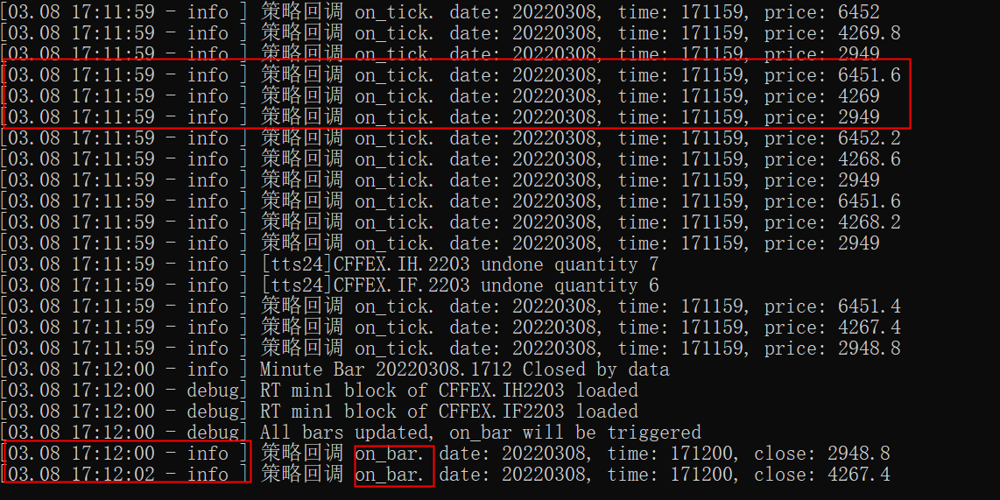

# HFT仿真进阶1: 环境准备

source: `{{ page.path }}`

之前写的 "HFT仿真详解" 仍然不够详细, 有很多细节仍然没有注意到, 比如何时回调策略中的 "on_bar" 接口?

延续我们的优良传统, 首先介绍环境准备内容, 然后再深入到源码部分.

HFT仿真运行 "WtRunner"目录, 行情数据运行 "WtDtPorter"目录

## 准备工作

### 1. 准备HFT策略配置文件

HFT配置文件参考文章"HFT仿真详解"

### 2. 准备对应的历史数据

如果没有dsb格式的历史数据参考文章"状态机详解" 或 "数据进阶: 全天候环境准备", 模拟一次收盘作业即可

### 3. 准备TestDtPorter

确保TestDtPorter可以正常运行

### 4. 注意事项

1. 本人测试需要用到`CFFEX.IC.2203`, `CFFEX.IF.2203`, `CFFEX.IH.2203`, 因此在 "WtRunner" 和 "WtDtPorter" 的 `parsers:` 相关配置都直接筛选出来了.
2. 确保WtRunner和WtDtPorter的配置共用数据目录

### 5. 重要的配置示例

**WtDtPorter**

dtcfg.yaml

```yaml
basefiles:
    utf-8: true     # 配置文件是否使用utf-8编码
    commodity: ./common/commodities.json
    contract: ./common/contracts.json
    holiday: ./common/holidays.json
    session: ./common/sessions.json
broadcaster:
    active: true
    bport: 3997
    broadcast:
    -   host: 255.255.255.255
        port: 9001
        type: 2
    multicast_:
    -   host: 224.169.169.169
        port: 9002
        sendport: 8997
        type: 0
    -   host: 224.169.169.169
        port: 9003
        sendport: 8998
        type: 1
    -   host: 224.169.169.169
        port: 9004
        sendport: 8999
        type: 2
parsers: mdparsers.yaml
statemonitor: statemonitor.yaml
writer:
    async: true
    groupsize: 300
    path: ../Storage        # 确保和WtRunner一致
    savelog: true
```

**WtRunner**

```yaml
basefiles:
    session: ./common/sessions.json
    commodity: ./common/commodities.json
    contract: ./common/contracts.json
    holiday: ./common/holidays.json
    hot: ./common/hots.json
    utf-8: true
env:
    name: hft		    # 确定交易引擎类型
    mode: product
    filters: filters.yaml
    fees: ./common/fees.json
    product: 
        session: TTS24   	# 为时间步进器提供
bspolicy: actpolicy.yaml
data:
    store:
        path: ../Storage/   # 确保和WtDtPorter一致
strategies:
    hft:
    -   active: true
        id: hft_demo
        name: WtHftStraFact.HftDemoStrategy
        params:
            code: CFFEX.IC.2203
            count: 10
            second: 10
            offset: 1
            count: 50
            stock: false
        trader: tts24
traders:
-   active: true
    id: tts24
    module: TraderCTP
    ctpmodule: tts_thosttraderapi_se
    front: tcp://122.51.136.165:20002
    broker: ""
    user: 1493
    pass: 123456
    appid:
    authcode:
    quick: true
    riskmon:
        active: false
        policy:
            default:
                order_times_boundary: 20
                order_stat_timespan: 10
                cancel_times_boundary: 20
                cancel_stat_timespan: 10
                cancel_total_limits: 470
parsers:
-   active: true
    broker: ""
    id: tts24
    module: ParserCTP
    front: tcp://122.51.136.165:20004
    ctpmodule: tts_thostmduserapi_se
    pass: ******
    user: ******
    filter: CFFEX
```

**数据目录Storage**

his
    min1
        CFFEX
            IC2203.dsb
            IF2203.dsb
            IH2203.dsb
    ticks
        CFFEX
            20220307
                IC2203.dsb
                IF2203.dsb
                IH2203.dsb

### 6. 示例策略

为了方便测试, 我们需要自己准备策略, 策略源码如下.

```cpp
#include "WtHftStraDemo.h"
#include "../Includes/IHftStraCtx.h"

#include "../Includes/WTSVariant.hpp"
#include "../Includes/WTSDataDef.hpp"
#include "../Includes/WTSContractInfo.hpp"
#include "../Share/TimeUtils.hpp"
#include "../Share/decimal.h"
#include "../Share/fmtlib.h"

extern const char* FACT_NAME;

WtHftStraDemo::WtHftStraDemo(const char* id)
	: HftStrategy(id)
	, _last_tick(NULL)
	, _last_entry_time(UINT64_MAX)
	, _channel_ready(false)
	, _last_calc_time(0)
	, _stock(false)
	, _unit(1)
	, _cancel_cnt(0)
	, _reserved(0)
{
}


WtHftStraDemo::~WtHftStraDemo()
{
	if (_last_tick)
		_last_tick->release();
}

const char* WtHftStraDemo::getName()
{
	return "HftDemoStrategy";
}

const char* WtHftStraDemo::getFactName()
{
	return FACT_NAME;
}

bool WtHftStraDemo::init(WTSVariant* cfg)
{
	//这里演示一下外部传入参数的获取
	_code = cfg->getCString("code");
	_secs = cfg->getUInt32("second");
	_freq = cfg->getUInt32("freq");
	_offset = cfg->getUInt32("offset");
	_reserved = cfg->getDouble("reserve");

	_stock = cfg->getBoolean("stock");
	_unit = _stock ? 100 : 1;

	return true;
}

void WtHftStraDemo::on_entrust(uint32_t localid, bool bSuccess, const char* message, const char* userTag)
{
	_ctx->stra_log_info("策略回调 on_entrust");
	return;
}

void WtHftStraDemo::on_init(IHftStraCtx* ctx)
{
	// 订阅tick数据
	WTSTickSlice* ticks = ctx->stra_get_ticks(_code.c_str(), 1);
	if (ticks)
		ticks->release();

	// 订阅K线, 被订阅的品种会回调on_bar
	WTSKlineSlice* kline1 = ctx->stra_get_bars("CFFEX.IF.2203", "m1", 1);
	if (kline1)
		kline1->release();
	WTSKlineSlice* kline2 = ctx->stra_get_bars("CFFEX.IH.2203", "m1", 1);
	if (kline2)
		kline2->release();

	// 主动订阅tick
	ctx->stra_sub_ticks("CFFEX.IH.2203");
	ctx->stra_sub_ticks("CFFEX.IC.2203");
	ctx->stra_sub_ticks("CFFEX.IF.2203");
	

	_ctx = ctx;
	_ctx->stra_log_info("策略回调 on_init");
}

void WtHftStraDemo::on_tick(IHftStraCtx* ctx, const char* code, WTSTickData* newTick)
{	
	// 每个被订阅的品种都会调用on_tick
	// newTick是类, actiontime是毫秒要/1000
	_ctx->stra_log_info(fmt::format("策略回调 on_tick. date: {}, time: {}, price: {}", newTick->actiondate(), newTick->actiontime()/1000, newTick->price()).c_str());

	return;
}

void WtHftStraDemo::check_orders()
{
	_ctx->stra_log_info("策略回调 check_orders");
	return;
}

// 每一个订阅K线的品种都会回调on_bar
void WtHftStraDemo::on_bar(IHftStraCtx* ctx, const char* code, const char* period, uint32_t times, WTSBarStruct* newBar)
{
	uint32_t barTime = (uint32_t)(newBar->time % 10000 * 100);
	_ctx->stra_log_info(fmt::format("策略回调 on_bar. date: {}, time: {}, close: {}", newBar->date, barTime, newBar->close).c_str());

	// 如果持仓<=0则买入, 否则卖出
	if (ctx->stra_get_position(code) <= 0)
		ctx->stra_enter_long(code, 0, 1.0, 0);
	else
		ctx->stra_enter_short(code, 0, 1.0, 0);

}

void WtHftStraDemo::on_trade(IHftStraCtx* ctx, uint32_t localid, const char* stdCode, bool isBuy, double qty, double price, const char* userTag)
{
	_ctx->stra_log_info("策略回调 on_trade");
}

void WtHftStraDemo::on_position(IHftStraCtx* ctx, const char* stdCode, bool isLong, double prevol, double preavail, double newvol, double newavail)
{
	_ctx->stra_log_info("策略回调 on_position");
}

void WtHftStraDemo::on_order(IHftStraCtx* ctx, uint32_t localid, const char* stdCode, bool isBuy, double totalQty, double leftQty, double price, bool isCanceled, const char* userTag)
{
	_ctx->stra_log_info("策略回调 on_order");
	return;
}

void WtHftStraDemo::on_channel_ready(IHftStraCtx* ctx)
{
	_ctx->stra_log_info("策略回调 on_channel_ready");
	return;
}

void WtHftStraDemo::on_channel_lost(IHftStraCtx* ctx)
{
	_ctx->stra_log_info("策略回调 on_channel_lost");

	_channel_ready = false;
}
```

1. 需要注意是我在策略 `WtHftStraDemo::on_init`中直接订阅了品种名称, 如果你没用这几个品种, 记得修改.
2. 修改完策略记得重新生成, 并将策略文件dll放到对应文件夹下

## 程序运行

1. 启动TestDtPorter, 确保能正常收到数据, 出现warning不用管, 此时 "Storage" 数据文件夹下应该会有一个 "rt" 目录
2. 启动WtRunner即可

## 成功验证

如果上述步骤都无误, 程序应该会在每个Tick打印3个品种的价格, 并在每分钟结束定时回调2个 "on_bar"


如果只是出现on_tick, 而on_bar并未正常调用也没关系, 接下来源码分析的文章会阐述为何需要这些配置以及为何会出现上述现象.