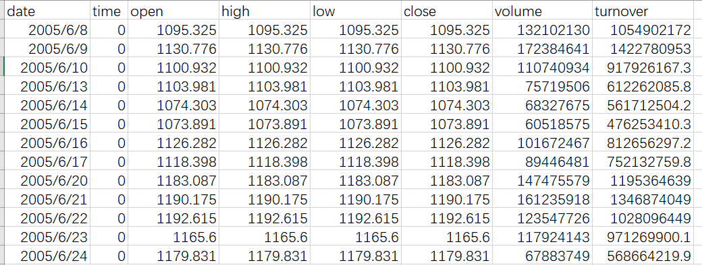
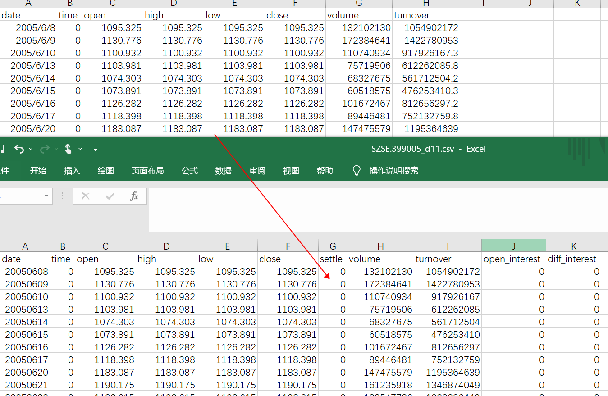

# testDtHelper

source: `{{ page.path }}`

## 简介

该示例主要帮助进行数据类型转换, WTCPP常用数据类型有三类
- dmb, 保存盘中临时数据
- dsb, 保存压缩历史数据
- csv, 保存历史数据, 可用于回测

示例中的 `PickleReader` 是专门用来处理Python专用数据类型 "pkl" 的, 暂时没用到, 不做介绍. 本节主要讨论 "csv" 和 "dsb" 互转

## 代码介绍

### 时间处理

1. `strToDate`, 将字符串日期转为数字日期
2. `strToTime`, 将字符串时间转为数字时间(精确到分), 如 "19:13" -> 1913
3. 注意事项:
- 1. WTPY底层几乎全部都用的数字日期
- 2. 这里时间精确到分, 但有时需要用到精确到秒, 甚至毫秒, 那时所有的数字日期和时间都要对应再乘以100和100000.
- 3. 在使用时, 数字日期和字符串日期相似(如2022/3/10 -> 20220310), 但是数字时间有区别, 会再加上1990年到现在的时间(看示例中的 `curBar.contents.time`计算过程就明白了)

### 函数调用

数据转存逻辑其实很简单, 因为所有逻辑都被封装在了底层, 上层直接调用`WtDtHelper`中的方法即可(话说好像wtpy所有模块都是如此...)

主要四个函数
- dump_bars, 将目录下dsb格式的bar数据转为csv
- dump_ticks, 将目录下dsb格式的tick数据转为csv
- store_bars, 将csv格式的bar数据转为dsb
- store_ticks, 将csv格式的tick数据转为dsb

前两个函数很好用, 直接传入对应**目录名**即可, `strFilter` 参数是多余的.

后两个函数涉及到数据类型转换, 稍微复杂点, 但逻辑很简单, 将数据存放到连续的内存段中, 然后传入内存段首地址即可.

 建议不要使用demo中给出的 `CsvReader` 函数读取csv文件, 因为它要求你的csv文件必须有固定的格式, 但是每个人的csv文件格式应该都不大一样, 所以最好自己写(直接pd.read_csv即可 ...).

### 数据转存示例
 
 这里给出完整示例. 因为我对Python和C++混编也不是很熟, 所以参考了其他朋友给出的示例(原网址 https://gitee.com/panyunan/wt4elegantrl-doc)

1.原始数据, 接上篇文章 "test_datafact" 从baostock下载的日数据


```python
# 读取csv文件
df = pd.read_csv("SZSE.399005_d.csv")
# 获取数据长度
count = df.shape[0]
# 创建结构体缓存
BUFFER = WTSBarStruct * count
buffer = BUFFER()
# 填充数据
for index, row in df.iterrows():
    curbar = buffer[index]
    curbar.date = strToDate(row["date"])
    curbar.open = float(row["open"])
    curbar.high = float(row["high"])
    curbar.low = float(row["low"])
    curbar.close = float(row["close"])
    curbar.vol = int(row["volume"])
    curbar.money = int(row["turnover"])
# csv->dsb
dtHelper = WtDataHelper()
dtHelper.store_bars(barFile="SZSE.399005_d.dsb", firstBar=buffer, count=count, period="d")
# dsb->csv
dtHelper.dump_bars(binFolder="./", csvFolder="dsb_csv")
```
注意事项:

1. `store_bars` 周期参数只能是 "m1", "m5"或"d"
2. 数据填充时, 左边 `curbar` 对应 `WTSBarStruct` 字段, 右边对应csv文件列名(每个数据类型查看 `WTSBarStruct`)
3. csv文件中有的数据列就填, 没有的列不用填, 底层会自动填充
4. 最后一步将已转存的dsb再转回csv是为了和原始数据对比, 以验证成功
5. tick和bar数据处理类似

### 成功示例



### 附录: tick数据转存代码

```python
from wtpy.WtCoreDefs import WTSBarStruct, WTSTickStruct, PriceQueueType


df = pd.read_csv("EURUSD_t.csv")
count = df.shape[0]
BUFFER = WTSTickStruct * count
buffer = BUFFER()
for index, row in df.iterrows():
    curbar = buffer[index]
    curbar.exchg = bytes(row["exchg"], encoding="utf-8")
    curbar.code = bytes(row["code"], encoding="utf-8")
    curbar.price = float(row["price"])
    curbar.open = float(row["open"])
    curbar.high = float(row["high"])
    curbar.low = float(row["low"])
    curbar.settle_price = float(row["settle_price"])
    curbar.trading_date = int(row["trading_date"])
    curbar.action_date = int(row["action_date"])
    curbar.action_time = int(row["action_time"])
    curbar.bid_prices = (PriceQueueType)(row["bid"])
    curbar.ask_prices = (PriceQueueType)(row["ask"])
dtHelper = WtDataHelper()
dtHelper.store_ticks(tickFile="EURUSD_t.dsb", firstTick=buffer, count=count)
dtHelper.dump_ticks(binFolder="./", csvFolder="dsb_csv")
```

填充方式和逻辑与bar相同, 注意事项, 底层默认数据精度3位小数, 如果你的品种数据精度大于3, 那也只保留3位