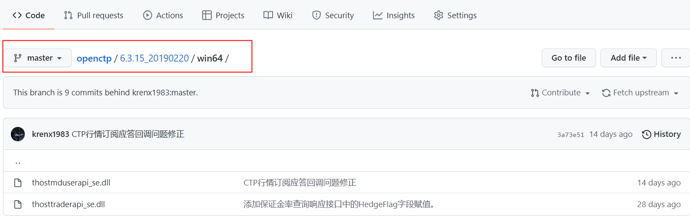
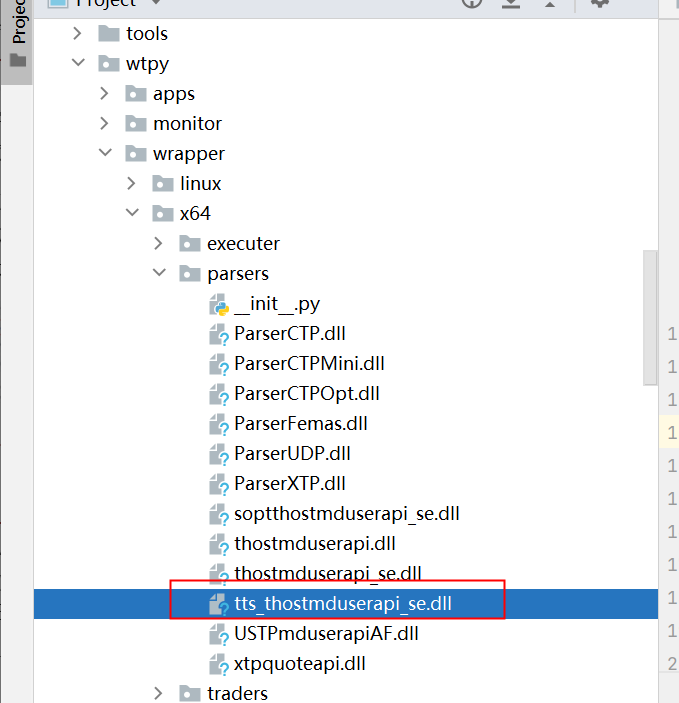

# datakit_fut

source: `{{ page.path }}`

## openctp 介绍:

[CTP开放平台提供A股、港股、美股、期货、期权等全品种接入通道，通过提供中泰证券XTP、华鑫证券奇点、东方证券OST、盈透证券TWS等各通道的CTPAPI接口，CTP程序可以无缝对接各股票柜台。平台也提供了一套基于TTS交易系统的模拟环境，同样提供了CTPAPI兼容接口，可以替代Simnow，为CTP量化交易开发者提供7x24可用的模拟环境。](https://github.com/dumengru/openctp)

## 对接openctp仿真注意事项

**openctp** 是极为优秀的仿真测试项目, 原本只要将ctp的两个dll文件替换掉就可以直接做仿真交易, 但 **openctp**的行情数据返回没有 `trading_date` 这个字段, 除此之外, 在7*24小时的测试环境中, 由于非交易时段的 `action_date` 和 `action_time` 小于本地时间, 因此 WonderTrader 项目中专门添加了配置字段 "localtime", 用本地时间填充对应的时间字段.


### 添加 tts_thostmduserapi_se.dll

1.进入 openctp 项目网站, 下载对应版本的 dll文件



2.将 `thostmduserapi_se.dll` 改名为 `tts_thostmduserapi_se.dll`(这里只用到行情dll), 并放到 "wtpy/wrapper/x64/parsers/" 目录下(注意我是win64操作系统)



## 修改配置 mdparsers.yaml

```yaml
parsers:
 # 一般环境
-   active: false   # 是否启动改环境
    broker: ""
    id: tts
    module: ParserCTP
    front: tcp://121.36.146.182:20004
    ctpmodule: tts_thostmduserapi_se
    localtime: true     # 这个字段用本地时间填充对应的字段, 仅供测试使用, 如simnow全天候行情，openctp等环境, 实盘一定要关闭
    # 去 openctp 项目网站查看申请方式
    pass: ******
    user: ******
    # 只接收 au 行情
    code: SHFE.au2204,SHFE.au2205
# 7*24 小时环境
-   active: true
    broker: ""
    id: tts24       
    module: ParserCTP
    front: tcp://122.51.136.165:20004
    ctpmodule: tts_thostmduserapi_se
    localtime: true     # 这个字段用本地时间填充对应的字段, 仅供测试使用, 如simnow全天候行情，openctp等环境, 实盘一定要关闭
    # 去 openctp 项目网站查看申请方式
    pass: ******
    user: ******
    # 只接收 au 行情
    code: SHFE.au2206,SHFE.au2208
```

**运行 "QuoteFactory/main.cpp" 程序**

行情界面如下


新目录如下


## 日志输出乱码

修改 `WtDtWrapper.py`

```python
def write_log(self, level, message:str, catName:str = ""):
    '''
    向组件输出日志
    '''
    self.api.write_log(level, bytes(message, encoding = "utf8"), bytes(catName, encoding = "utf8"))

```