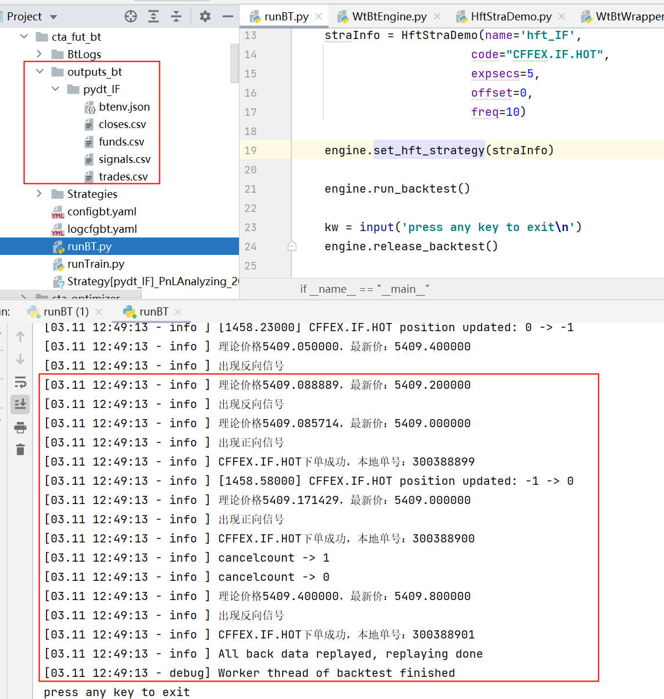

# hft_fut_bt.runBT

source: `{{ page.path }}`

## 简介

这个示例主要是为了展示HFT策略的回测流程, 同目录下的 `runTrain` 是做强化学习的示例, 暂且搁置吧

## 回测引擎

回测主要用到 `WtBtEngine`, 该类中有几个重要的属性
- `self.__wrapper__`, 接口转换器, 负责所有与底层交互的动作, 这个属性最重要, 相关的方法建议查看 `WtBtWrapper`
- `self.__context__`, ctx映射表, 负责策略中获取环境信息(比如获取数据, 获取持仓等, 相关的方法及说明可以在 `HftContext` 中查看)
- `self.__config__` , 保存配置信息
- `self.__wrapper__.initialize_hft`, 创建回测对象时, 会直接初始化 HFT 环境, 该方法主要是注册一些回调函数, 每个函数的说明可以在 `WtCoreDefs` 中查看

### engine.init

回测引擎初始化, 主要做以下几个动作
- 加载回测配置文件 `configbt.yaml`
- 根据回测配置文件加载其他相关配置文件
    - `commodities.json`, 品种信息
    - `contracts.json`, 合约信息
    - `sessions.json`, 交易时段信息(最复杂)
    - `holidays.json`, 节日信息
    - `hots.json`, 主力合约切换信息
    - `seconds.json`, 次主力合约信息
- 将加载的信息保存到对应的类对象中 `self.contractMgr` 和 `self.sessionMgr`

#### 时间偏移

这里解释下为何 `sessions.json` 文件最复杂, 因为WT为了控制夜盘和日盘统一, 用到了"时间偏移"的概念, 配置中的 `offset` 就是为了控制偏移的分钟数.

```json
"FN0100":{
    "name":"期货夜盘0100",
    "offset": 300,
    "auction":{
        "from": 2059,
        "to": 2100
    },
    "sections":[
        {
            "from": 2100,
            "to": 100
        },
        {
            "from": 900,
            "to": 1015
        },
        {
            "from": 1030,
            "to": 1130
        },
        {
            "from": 1330,
            "to": 1500
        }
    ]
},
```

以这段配置为例, `offset: 300`, 所有传入的时间都会向后推移300分钟, 所以 `2100` 会变成 `0200`. 

"why?"
`2100`是数字时间,  变成真正时间应该是 "21:00", 向后偏移300分钟即5小时, 即第二天凌晨"2:00", 再转为数字时间 `0200`.

所有时间向后偏移300分钟后, 夜盘的时间就会小于日盘, 即 `2100` 小于 `0200`, `900` 变为 `1400`, `0200` < `1400`

你看明白了吗?

有人会问, 为什么是300, 而不是250? 其实无所谓, 自己算算账, 保证夜盘时间转换后小于日盘时间即可.

### engine.configBacktest

设置回测起始时间和结束时间, 注意是数字时间, 精确到分钟.

WTPY底层几乎全部用的是数字时间, "9:00", 变为 `0900`等等(这部分内容前面的文章应该提到过)

### engine.configBTStorage

设置回测的数据模式和数据存储目录, 数据模型主要是 "csv" 和 "bin" 格式, 其实首先会从自定义的 `extloader` 加载数据, 如果加载不到, 再按 csv/bin 加载. 

还要注意数据存放目录的格式, 如果是自己准备的数据, 数据文件名和文件夹名必须按照 "storage/" 模板来写, 如果是用wtpy接收的市场数据, 收盘之后会自动处理成标准格式.

### engine.commitBTConfig

提交配置, 将配置参数传入回测引擎
`self.__wrapper__.config_backtest` -> `self.api.config_backtest`

这个逻辑在底层, 底层做了那些事呢?

- 1. 初始化事件推送器
- 2. 初始化底层数据回放引擎
- 3. 初始化策略工厂

### straInfo = HftStraDemo

创建策略对象, `HftStraDemo` 就是策略示例文件, 编写策略按照这个模板就好

```yaml
hft0:
    error_rate: 30
    # 策略工厂名称
    module: WzHftStraFact
    strategy:
        # 策略名称
        name: OrderImbalance
        # 策略参数
        params:
            active_sections:
            -   end: 1457
                start: 931
            beta_0: 0.01171
            # 交易品种, 注意格式
            code: CFFEX.IF.HOT
            ...
    # 是否使用最新价
    use_newpx: true
```

### engine.set_hft_strategy

传入策略对象, 创建策略环境, 创建策略上下文管理器(即, HftStraDemo中的参数 context: HftContext)

### engine.run_backtest

调用底层代码进行回测

### engine.release_backtest

最后一定记得释放框架

## 修改文件编码

如果你的运行结果是乱码, 需要修改日志输出的编码格式. 有以下几个地方需要改动

1.`WtBtWrapper.py`

```python
def write_log(self, level, message:str, catName:str = ""):
    self.api.write_log(level, bytes(message, encoding = "utf8"), bytes(catName, encoding = "utf8"))
```

```python
def hft_log_text(self, id:int, message:str):
    '''
    日志输出
    @id         策略ID
    @message    日志内容
    '''
    self.api.hft_log_text(id, bytes(message, encoding = "utf8"))
```

```tip
以上地方修改后应该就可以正常运行HFT策略的 "runBT.py" 文件了, 但是为了以后方便, 建议将其他地方编码一起改了吧
```

1.WtBtWrapper.py

`cta_log_text` 和 `sel_log_text` 仿照上述 `hft_log_text` 修改

2.WtDtHelper.py

```python
def on_log_output(message:str):
    message = bytes.decode(message, 'utf-8')
    print(message)
```

## 成功示例

回测输出文件保存在 "outputs_bt" 中

